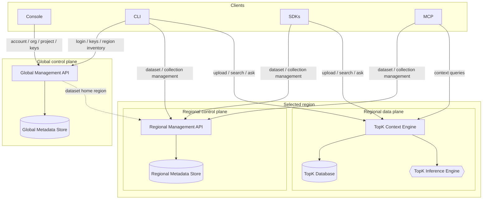
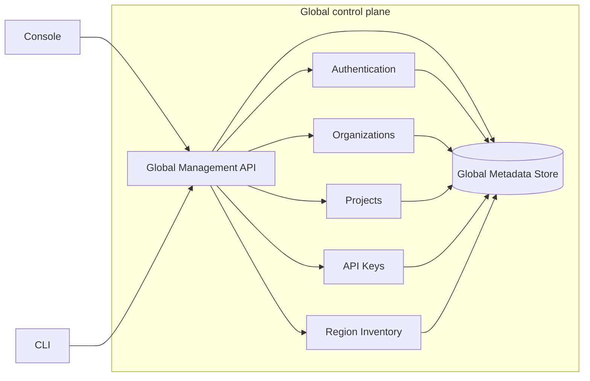
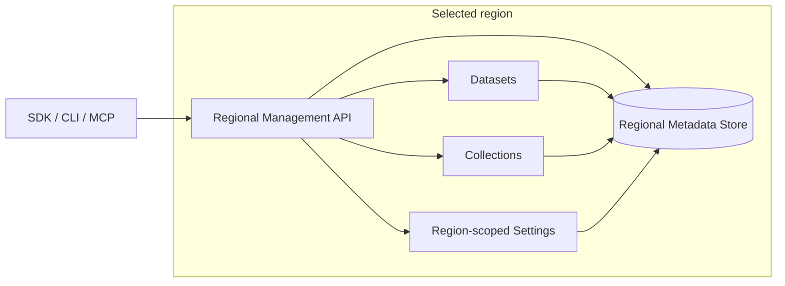
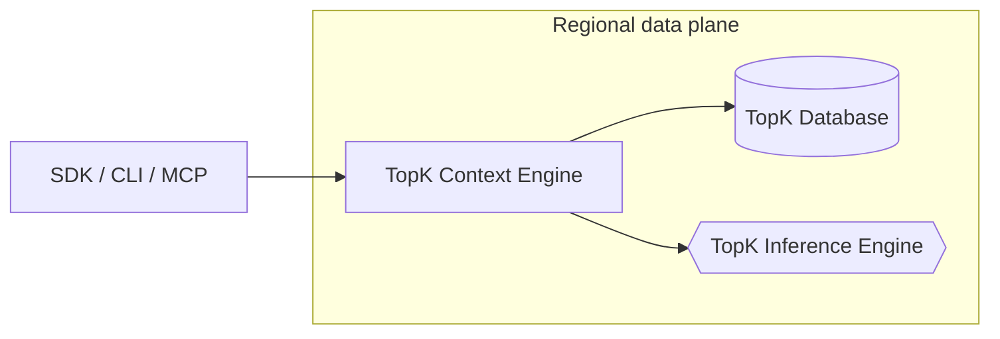
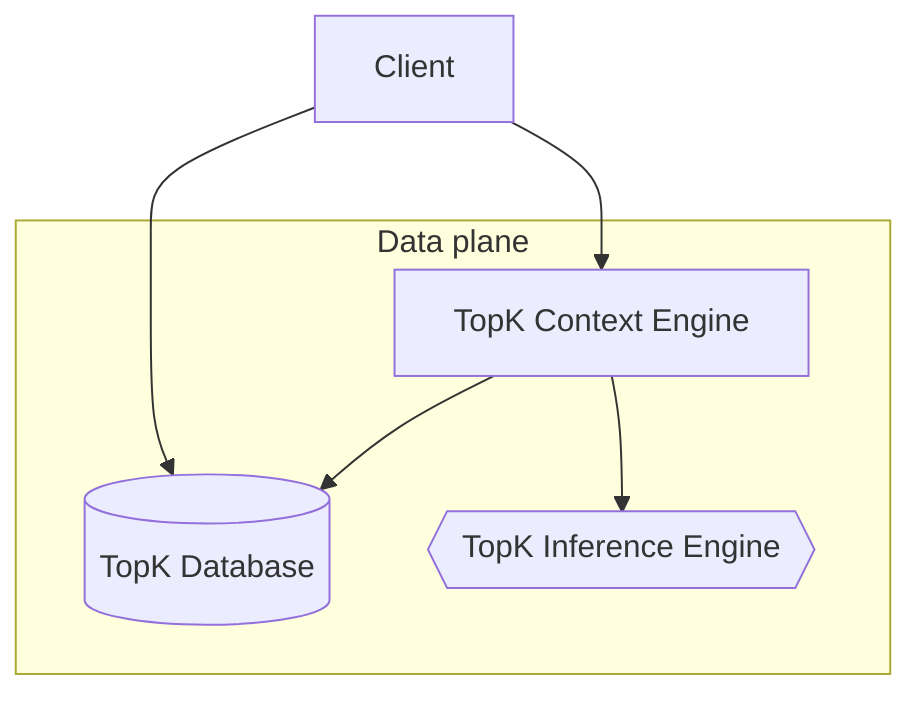
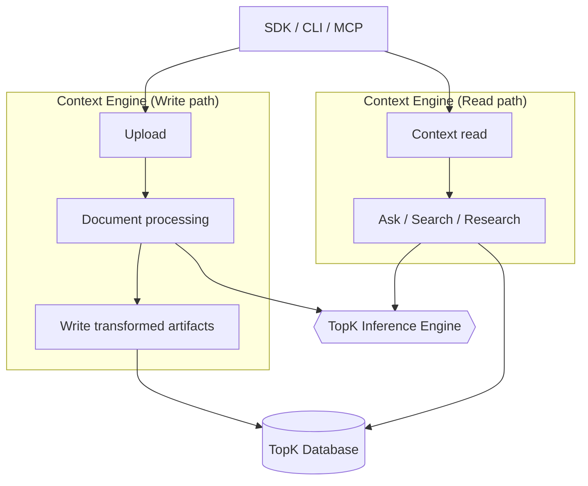
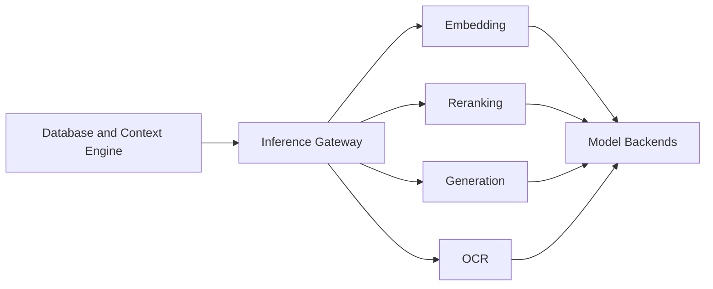

## Overview

TopK is designed to separate platform management from customer-data workloads.

The **global control plane** manages organizations, projects, API keys, account-level settings, routing metadata, and cross-region inventory. It records the home region for each dataset and collection.

Each **regional control plane** exposes management APIs for datasets and collections in that region.

Each **regional data plane** runs customer-data workloads in the selected region, including storage, indexing, ingestion, retrieval, context workflows, and inference.

This separation keeps the global control plane out of the hot path for dataset reads, writes, retrieval, and inference, while allowing each regional deployment to operate close to the data it serves.

<Info>
  Dataset workloads are served by the regional data plane. The global control plane manages account-level resources and routing metadata; it does not serve dataset reads, writes, retrieval, or inference requests.
</Info>

## Architecture principles

TopK is built around a few core architectural principles:

<CardGroup cols={2}>
  <Card title="Control and data plane separation" icon="split">
    Management workflows are separated from customer-data workloads. The global control plane is not on the hot path for reads, writes, retrieval, or inference.
  </Card>

  <Card title="Regional data residency" icon="map">
    Dataset data, transformed artifacts, indexes, and workload execution are scoped to the selected region.
  </Card>

  <Card title="Regional failure isolation" icon="shield">
    Regional deployments operate as isolated workload environments.
  </Card>

  <Card title="Composable retrieval stack" icon="layers">
    Storage, indexing, ingestion, retrieval, and inference are separate services with clear responsibilities.
  </Card>
</CardGroup>

## Operational model

TopK is organized into three operational planes:

<CardGroup cols={1}>
  <Card title="Global control plane" icon="globe" href="/architecture#global-control-plane">
    Account-level management for organizations, projects, API keys, routing metadata, and cross-region inventory.
  </Card>
</CardGroup>

<CardGroup cols={2}>
  <Card title="Regional control plane" icon="layout-dashboard" href="/architecture#regional-control-plane">
    Region-scoped management APIs and metadata for datasets and collections.
  </Card>

  <Card title="Regional data plane" icon="database" href="/architecture#regional-data-plane">
    In-region workload execution for storage, indexing, ingestion, retrieval, context workflows, and inference.
  </Card>
</CardGroup>

## Deployment model

The diagram below shows how clients interact with the global control plane, regional control plane, and regional data plane.

## Request paths

TopK separates management requests from customer-data workload requests.

### Account and project management

Account-level operations go to the global control plane.

This includes organization management, project management, API key management, account-level settings, and region inventory.

### Dataset and collection management

Dataset and collection management requests are handled by the regional control plane in the dataset’s home region.

### Ingestion and retrieval path

Reads, writes, search, ask, ingestion, retrieval, and inference are served by the regional data plane.

## Control plane

The control plane manages metadata, configuration, and administrative operations for datasets, collections, and resources within the system.

### Global control plane

The global control plane owns account-level management workflows.

It manages:

- Organizations
- Projects
- API keys
- Account-level settings
- Region inventory
- Routing metadata
- Dataset and collection home-region records

The global control plane records where each dataset and collection belongs, but it is not on the hot path for dataset reads, writes, retrieval, or inference.

Clients use credentials issued through the global control plane together with an explicit region to connect to the correct regional deployment.

<Info>
  The global control plane exposes management APIs and stores routing metadata. It does not serve customer-data workload requests.
</Info>

### Regional control plane

Each region runs its own control plane for region-scoped dataset and collection management.

The regional control plane manages metadata and APIs for resources in that region. It is responsible for management operations such as creating, updating, listing, and deleting region-scoped dataset and collection resources.

The regional control plane is separate from the regional data plane. Management operations are isolated from the hot path for reads, writes, ingestion, retrieval, and inference.

## Data plane

The regional data plane is where customer-data workloads run and where dataset data lives.

Within each region, clients connect to the data plane for dataset workloads:

<Note>
    The data plane runs in the selected region, close to the data it serves.
</Note>

## Core components

TopK consist of three core components which are deployed in the regional data plane:

<Steps>
  <Step title="TopK Database">
    Durable storage, indexing, query planning, and query execution.
  </Step>

  <Step title="TopK Context Engine">
    Document ingestion, transformation, retrieval orchestration, and context workflows.
  </Step>

  <Step title="TopK Inference Engine">
    Regional model serving for embedding, reranking, generation, and OCR.
  </Step>
</Steps>

### TopK Database

The TopK Database is the regional execution and storage system.

Writes flow through the writer into durable storage. Queries are planned by the database router and executed by the query layer against stored data and indexes. Compactors reorganize stored data in the background.

<Frame caption="TopK Database Architecture Diagram">
  
</Frame>

### TopK Context Engine

The TopK Context Engine orchestrates ingestion of documents and retrieval.

It handles source documents, transforms them into searchable artifacts, writes that output into the database, and serves retrieval and MCP-oriented context workflows.

### TopK Inference Engine

The TopK Inference Engine is the regional model-serving layer.

It exposes a single inference entry point and dispatches requests to capability-specific model backends.

## Where the data lives

The table below summarizes the split between global management, regional metadata, and regional workload execution.

| Resource or workload | Global control plane | Regional control plane | Regional data plane |
| --- | --- | --- | --- |
| Organizations | Yes | No | No |
| Projects | Yes | No | No |
| API keys | Yes | Used for regional access | No |
| Region inventory | Yes | No | No |
| Dataset metadata | Yes, including home region | Yes, region-scoped | No |
| Collection metadata | Yes, including home region | Yes, region-scoped | No |
| Transformed artifacts | No | No | Yes |
| Indexes | No | No | Yes |
| Query execution | No | No | Yes |
| Ingestion pipelines | No | No | Yes |
| Retrieval workflows | No | No | Yes |
| Embedding | No | No | Yes |
| Reranking | No | No | Yes |
| Generation | No | No | Yes |
| OCR | No | No | Yes |

## Failure domains

TopK separates global management workflows from regional dataset workloads.

<CardGroup cols={1}>
  <Card title="Global control plane" icon="globe">
    If the global control plane is unavailable, account-level management operations such as organization changes, project changes, API key management, and region inventory updates may be affected.
  </Card>

  <Card title="Regional control plane" icon="layout-dashboard">
    If a regional control plane is unavailable, dataset and collection management operations in that region may be affected.
  </Card>

  <Card title="Regional data plane" icon="database">
    If a regional data plane is unavailable, dataset workloads in that region may be affected, while other regions remain isolated.
  </Card>
</CardGroup>

<Note>
  Existing regional dataset workloads do not depend on the global control plane being in the request path.
  Clients target the region directly and authenticate with an existing API key.
</Note>

## Security and trust boundaries

TopK separates account metadata from customer data.

- Account, organization, project, API key, routing, and inventory metadata are managed by the global control plane.
- Region-scoped dataset and collection metadata is managed by the regional control plane.
- Dataset data, transformed artifacts, indexes, and workload execution are handled by the regional data plane.
- Management APIs and workload APIs are separate surfaces with separate operational responsibilities.
- Regional services enforce access using credentials issued through the global control plane.

## API surfaces

TopK can be accessed through SDKs, the CLI, the MCP server, and the Console.

### SDKs and CLI

<CardGroup cols={2}>
  <Card title="CLI" icon="terminal" href="/cli">
    Command-line interface for upload, search, ask, and management workflows.

    

      <Badge icon="globe" color="blue" shape="pill">Global control plane</Badge>
      <Badge icon="layout-dashboard" color="purple" shape="pill">Regional control plane</Badge>
      <Badge icon="database" color="green" shape="pill">Regional data plane</Badge>
    

  </Card>

  <Card title="Python SDK" icon="/icons/python.svg" href="/sdk/topk-py/overview">
    Python client library and API reference.

    

      <Badge icon="layout-dashboard" color="purple" shape="pill">Regional control plane</Badge>
      <Badge icon="database" color="green" shape="pill">Regional data plane</Badge>
    

  </Card>

  <Card title="JavaScript SDK" icon="/icons/js.svg" href="/sdk/topk-js/overview">
    TypeScript/JavaScript client for Node.js.

    

      <Badge icon="layout-dashboard" color="purple" shape="pill">Regional control plane</Badge>
      <Badge icon="database" color="green" shape="pill">Regional data plane</Badge>
    

  </Card>

  <Card title="Rust SDK" icon="/icons/rust.svg" href="https://github.com/topk-io/topk/tree/main/topk-rs">
    Rust client library.

    

      <Badge icon="layout-dashboard" color="purple" shape="pill">Regional control plane</Badge>
      <Badge icon="database" color="green" shape="pill">Regional data plane</Badge>
    

  </Card>
</CardGroup>

<Columns cols={2} className="mt-2">
  <Column>
    **MCP Server**

    <Card title="MCP" icon="network" href="/mcp-server">
      Connect TopK to MCP-compatible clients or agents to query your datasets.

      

        <Badge icon="layout-dashboard" color="purple" shape="pill">Regional control plane</Badge>
        <Badge icon="database" color="green" shape="pill">Regional data plane</Badge>
      

    </Card>
  </Column>

  <Column>
    **Console**

    <Card title="Console" icon="settings" href="https://console.topk.io">
      Web console for managing your account, organization, projects, usage, and spend.

      

        <Badge icon="globe" color="blue" shape="pill">Global control plane</Badge>
      

    </Card>
  </Column>
</Columns>

## Summary

TopK’s architecture separates global management, regional metadata, and regional workload execution.

- The **global control plane** manages accounts, projects, API keys, routing metadata, and cross-region inventory.
- The **regional control plane** manages datasets and collections in the selected region.
- The **regional data plane** serves customer-data workloads, including storage, indexing, ingestion, retrieval, and inference.
