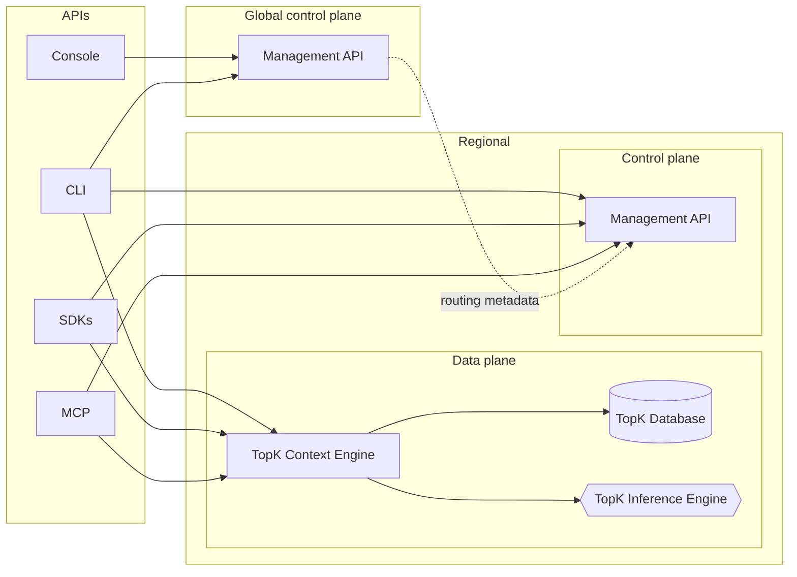
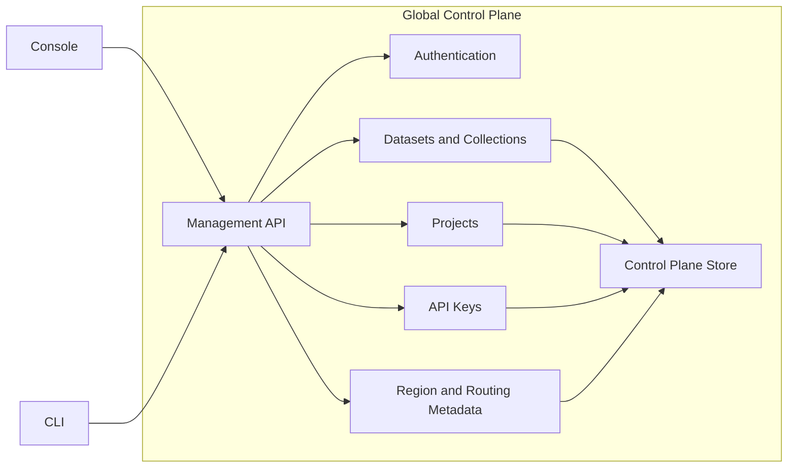
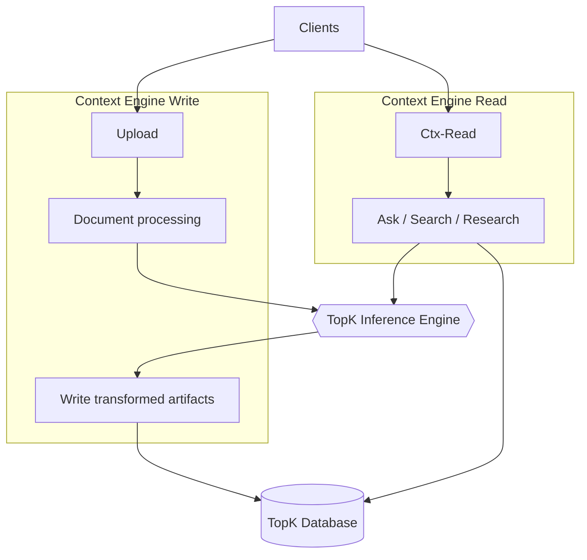
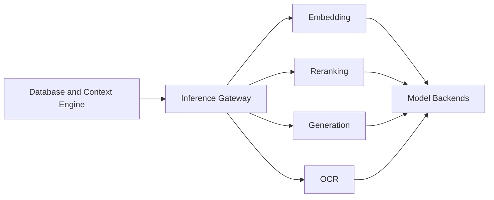
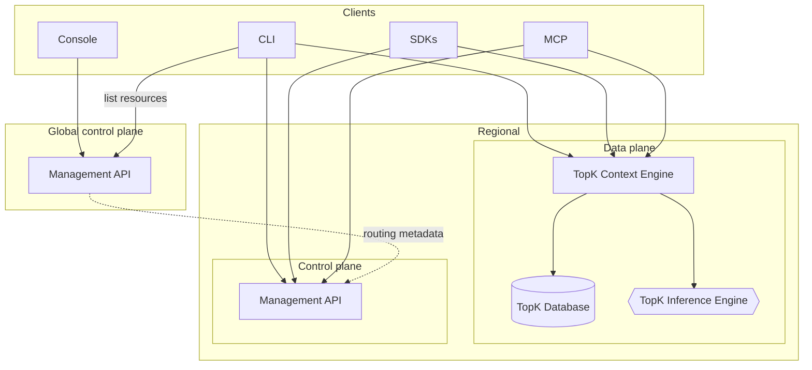

## Overview

TopK is built from these core components:

<Steps>
  <Step title="TopK Database">
    Durable storage, indexing, routing, and query execution.
  </Step>
  <Step title="TopK Context Engine">
    Document ingestion, transformation, and context retrieval.
  </Step>
  <Step title="TopK Inference Engine">
    Embedding, reranking, generation, and OCR.
  </Step>
</Steps>

In terms of accessing resources, the system is split into a **control plane** and a **data plane**.

**Global** control plane covers organizations, projects, API keys, routing metadata, and cross-region inventory (including dataset and collection records and their home region).

**Regional** control plane exposes dataset and collection management APIs backed by metadata scoped to that geography. The **data plane** runs storage, indexing, ingestion, retrieval, and inference in your selected region next to your data.

The platform is accessed through these API clients:

**SDKs and CLI**

<CardGroup cols={2}>
  <Card title="CLI" icon="terminal" href="/cli">
    Command-line interface for upload, search, and ask.

    

      <Badge icon="globe" color="blue" shape="pill">Global control plane</Badge>
      <Badge icon="database" color="green" shape="pill">Data plane</Badge>
      <Badge icon="layout-dashboard" color="purple" shape="pill">Control plane</Badge>
    

  </Card>
  <Card title="Python SDK" icon="/icons/python.svg" href="/sdk/topk-py/overview">
    Python client library and API reference.

    

      <Badge icon="database" color="green" shape="pill">Data plane</Badge>
      <Badge icon="layout-dashboard" color="purple" shape="pill">Control plane</Badge>
    

  </Card>
  <Card title="JavaScript SDK" icon="/icons/js.svg" href="/sdk/topk-js/overview">
    TypeScript/JavaScript client for Node.js.

    

      <Badge icon="database" color="green" shape="pill">Data plane</Badge>
      <Badge icon="layout-dashboard" color="purple" shape="pill">Control plane</Badge>
    

  </Card>
  <Card title="Rust SDK" icon="/icons/rust.svg" href="https://github.com/topk-io/topk/tree/main/topk-rs">
    Rust client library.

    

      <Badge icon="database" color="green" shape="pill">Data plane</Badge>
      <Badge icon="layout-dashboard" color="purple" shape="pill">Control plane</Badge>
    

  </Card>
</CardGroup>

<Columns cols={2} className="mt-2">
    <Column>
        **MCP Server**

        <Card title="MCP" icon="network" href="/mcp-server">
          Connect TopK to MCP-compatible clients or agents to query your datasets.

          

            <Badge icon="database" color="green" shape="pill">Data plane</Badge>
            <Badge icon="layout-dashboard" color="purple" shape="pill">Control plane</Badge>
          

        </Card>
    </Column>
    <Column>
        **Console**

        <Card title="Console" icon="settings" href="https://console.topk.io">
          Web console for managing your account, organization, projects, usage and spend.

          

            <Badge icon="globe" color="blue" shape="pill">Global control plane</Badge>
          

        </Card>
    </Column>
</Columns>

Operationally, the platform is split into:

<CardGroup cols={1}>
  <Card title="Global control plane" icon="globe" href="/architecture#global-control-plane">
    Accounts, projects, datasets, metadata, and management APIs—shared policy and inventory across regions.
  </Card>
</CardGroup>

<CardGroup cols={2}>
  <Card title="Regional control plane" icon="layout-dashboard" href="/architecture#regional-control-plane">
    In-region metadata and management APIs.
  </Card>
  <Card title="Regional data plane" icon="database" href="/architecture#regional-data-plane">
    Storage, indexing, inference, context, and retrieval scoped to your region.
  </Card>
</CardGroup>

## Architecture

The diagrams below group the control plane (global and per region) and data plane (database, context engine, inference), then show data flow across the platform.

### Platform overview

This first diagram shows the API surfaces and how clients reach the global control plane versus a regional deployment: the data plane (storage, context, inference) and the control plane (in-region management APIs).

### Control plane

<a id="global-control-plane" />

#### Global

The global control plane owns the organization and project-specific workflows.
It provides the management access to the organization, project, dataset and collection settings.

It also manages API keys and records which region each dataset and related resource configuration belongs to.
Clients use those credentials together with an explicit region to reach the correct data plane for dataset workloads and the control plane for in-region management APIs.

<Info>
The global control plane exposes management APIs and holds the routing metadata — it does not sit in the hot path for context engine or database requests.
</Info>

<a id="regional-control-plane" />

#### Regional

Each region runs its own control plane for dataset and collection management. That metadata and those APIs are scoped to the geography, so inventory and changes apply only to resources in that region. The global control plane supplies routing metadata so clients address the right deployment.

<a id="regional-data-plane" />

### Data plane

The data plane is where workloads run and data lives: storage, indexing, ingestion and retrieval, and inference.

#### Database

The TopK Database is the regional execution and storage system. Writes flow through the writer into durable storage, queries are planned by the router, and the query layer scans stored data and indexes. Compactors continuously reorganize stored data in the background.

<Frame caption="TopK Database Architecture Diagram">
  
</Frame>

#### Context Engine

The TopK Context Engine orchestrates ingestion and retrieval. It accepts source content, transforms it into searchable artifacts, writes that output into the database, and serves retrieval and MCP-oriented context workflows.

#### Inference Engine

The TopK Inference Engine is a shared regional model-serving layer. It exposes a single inference entry point and dispatches requests to the capability-specific model backends.

## Data flow

Read top to bottom: the console uses the global control plane only. SDKs and MCP use a regional API host and talk to the regional data plane and control plane (the usual client configuration). The CLI uses the global control plane for some operations and the regional deployment for others. The global management API supplies routing metadata to the regional control plane. Inside the data plane, the context engine coordinates the database and inference.

