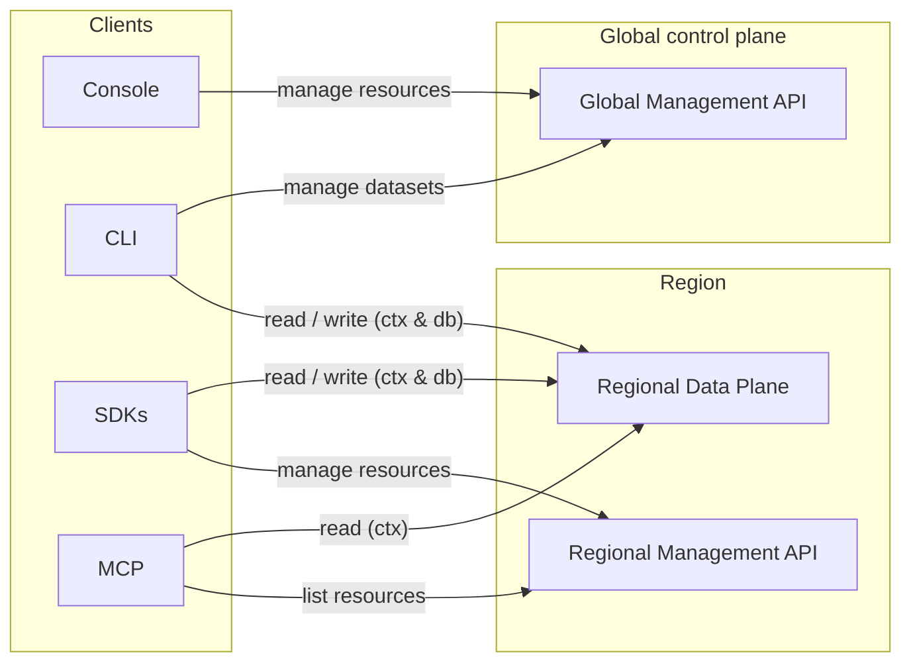
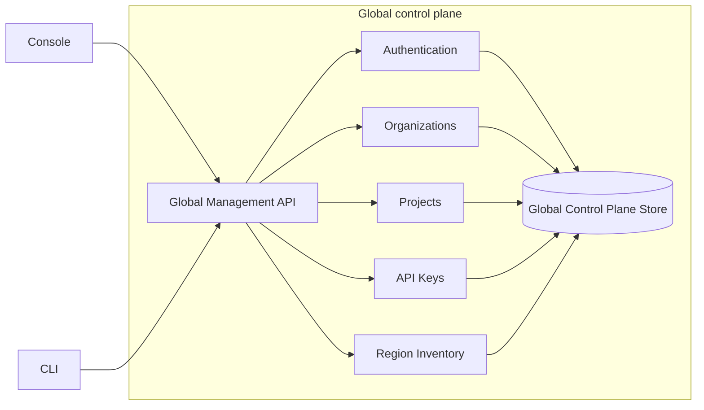
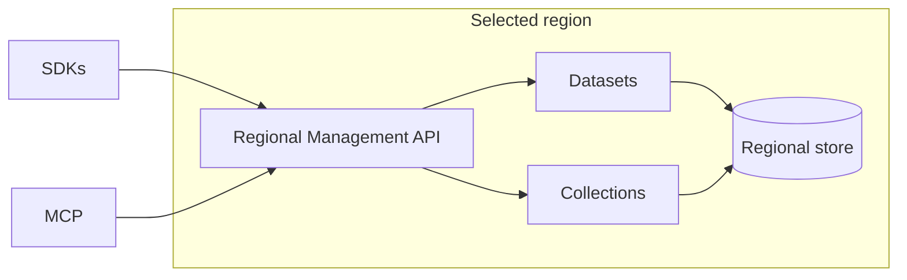
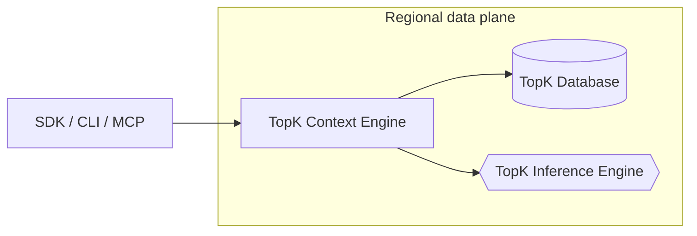
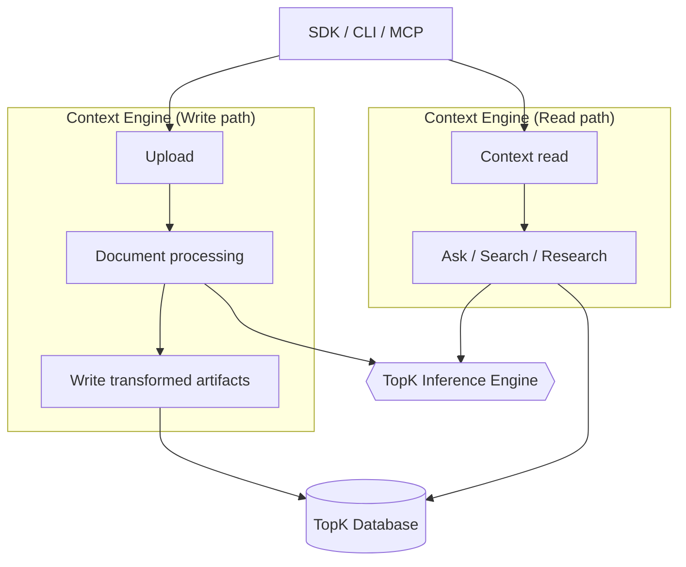
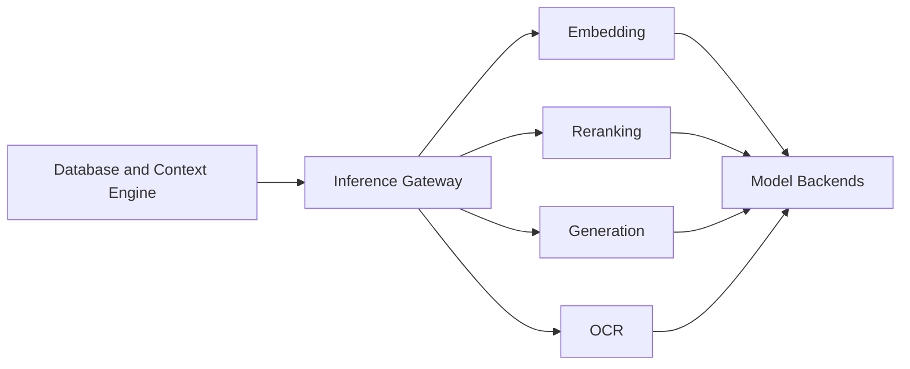

## Overview

TopK separates customer-data workloads from resource management across two operational planes: the **control plane** and the **data plane**.
There is a single **global** control plane and multiple **regional** control planes, deployed alongside the regional data planes.

* The **global control plane** manages organizations, projects, API keys, account-level settings, and routing metadata. It also holds the region for each dataset and collection.
* The **regional control plane** exposes management APIs for datasets and collections in that region.
* The **regional data plane** runs customer-data workloads in the selected region, including storage, indexing, ingestion, retrieval, context workflows, and inference.

<Info>
    This separation keeps account-level management out of the hot path for dataset reads, writes, retrieval, and inference, while allowing each regional deployment to operate close to the data it serves.
</Info>

## Architecture principles

TopK is built around a few core architectural principles:

<CardGroup cols={1}>
  <Card title="Control and data plane separation" icon="split" horizontal>
    Management workflows are separated from customer-data workloads. The global control plane is not on the hot path for reads, writes, retrieval, or inference.
  </Card>

  <Card title="Regional data residency" icon="map" horizontal>
    Dataset or collection data, transformed artifacts, indexes, and workload execution are scoped to the selected region.
  </Card>

  <Card title="Regional failure isolation" icon="shield" horizontal>
    Regional deployments operate as isolated workload environments.
  </Card>
</CardGroup>

## Operational model

TopK is organized into three operational planes:

<CardGroup cols={1}>
  <Card title="Global control plane" icon="globe">
    Account-level management for organizations, projects, API keys, and routing metadata.
  </Card>
</CardGroup>

<CardGroup cols={2}>
  <Card title="Regional control plane" icon="layout-dashboard">
    Region-scoped management APIs and metadata for datasets and collections.
  </Card>

  <Card title="Regional data plane" icon="database">
    In-region workload execution for storage, indexing, ingestion, retrieval, context workflows, and inference.
  </Card>
</CardGroup>

## Deployment model

The diagram below shows how clients interact with the global control plane, regional control plane, and regional data plane.

## Request paths

TopK separates management requests from customer-data workload requests.

### Account and project management

Account-level operations go to the global control plane.

This includes organization management, project management, API key management, account-level settings, and region inventory.

### Dataset and collection management

Dataset and collection management requests are handled by the regional control plane.

### Ingestion and retrieval

Reads, writes, search, ask, ingestion, retrieval, and inference are served by the regional data plane.

## Core components

TopK consist of three core components which are deployed in the regional data plane:

<Steps>
  <Step title="TopK Database">
    Durable storage, indexing, query planning, and query execution.
  </Step>

  <Step title="TopK Context Engine">
    Document ingestion, transformation, retrieval orchestration, and context workflows.
  </Step>

  <Step title="TopK Inference Engine">
    Regional model serving for embedding, reranking, generation, and OCR.
  </Step>
</Steps>

### TopK Database

The TopK Database is an independent, durable storage system.

It is used by the TopK Context Engine as well as the TopK Inference Engine, however it can be used as a standalone component
to power hybrid retrieval workflows.

The full documentation for the TopK Database is available [here](/database).

<Frame caption="TopK Database Architecture Diagram">
  
</Frame>

### TopK Context Engine

The TopK Context Engine orchestrates ingestion of documents and retrieval.

It handles source documents, transforms them into searchable artifacts, writes that output into the database, and serves retrieval and MCP-oriented context workflows.

### TopK Inference Engine

The TopK Inference Engine is the regional model-serving layer.

It exposes a single inference entry point and dispatches requests to capability-specific model backends.

## Where the data lives

The table below summarizes the split between global management, regional metadata, and regional workload execution.

| Resource or workload | Global control plane | Regional control plane | Regional data plane |
| --- | --- | --- | --- |
| Organizations | **Yes** | No | No |
| Projects | **Yes** | No | No |
| API keys | **Yes** | No | No |
| Dataset metadata | **Yes** | Yes, region-scoped | No |
| Collection metadata | **Yes**| Yes, region-scoped | No |
| DB indexes | No | No | **Yes** |
| Ingestion | No | No | **Yes** |
| Retrieval | No | No | **Yes** |
| Inference | No | No | **Yes** |

## Failure domains

TopK separates global management workflows from regional dataset workloads.

<CardGroup cols={1}>
  <Card title="Global control plane" icon="globe">
    If the global control plane is unavailable, account-level management operations such as organization changes, project changes, API key management, and region inventory updates may fail.
  </Card>

  <Card title="Regional control plane" icon="layout-dashboard">
    If a regional control plane is unavailable, dataset and collection management operations in that region may fail.
  </Card>

  <Card title="Regional data plane" icon="database">
    If a regional data plane is unavailable, dataset workloads in that region may fail, while other regions remain isolated.
    Persisted data remains durable according to TopK's storage guarantees.
  </Card>
</CardGroup>

<Note>
  Existing regional dataset workloads do not depend on the global control plane being in the request path.
  Clients target the region directly and authenticate with an existing API key.
</Note>

## Security and trust boundaries

TopK separates account metadata from customer data.

- Account, organization, project, API key, and routing metadata are managed by the global control plane.
- Region-scoped dataset and collection metadata is managed by the regional control plane.
- Dataset or collection data, transformed artifacts, indexes, and workload execution are handled by the regional data plane.
- Management APIs and workload APIs are separate surfaces with separate operational responsibilities.
- Regional services enforce access using credentials issued through the global control plane.

## API surfaces

TopK can be accessed through SDKs, the CLI, the MCP server, and the Console.

### SDKs and CLI

<CardGroup cols={2}>
  <Card title="CLI" icon="terminal" href="/cli">
    Command-line interface for upload, search, ask, and management workflows.

    

      <Badge icon="globe" color="blue" shape="pill">Global control plane</Badge>
      <Badge icon="database" color="green" shape="pill">Regional data plane</Badge>
    

  </Card>

  <Card title="Python SDK" icon="/icons/python.svg" href="/sdk/topk-py/overview">
    Python client library and API reference.

    

      <Badge icon="layout-dashboard" color="purple" shape="pill">Regional control plane</Badge>
      <Badge icon="database" color="green" shape="pill">Regional data plane</Badge>
    

  </Card>

  <Card title="JavaScript SDK" icon="/icons/js.svg" href="/sdk/topk-js/overview">
    TypeScript/JavaScript client for Node.js.

    

      <Badge icon="layout-dashboard" color="purple" shape="pill">Regional control plane</Badge>
      <Badge icon="database" color="green" shape="pill">Regional data plane</Badge>
    

  </Card>

  <Card title="Rust SDK" icon="/icons/rust.svg" href="https://github.com/topk-io/topk/tree/main/topk-rs">
    Rust client library.

    

      <Badge icon="layout-dashboard" color="purple" shape="pill">Regional control plane</Badge>
      <Badge icon="database" color="green" shape="pill">Regional data plane</Badge>
    

  </Card>
</CardGroup>

<Columns cols={2} className="mt-2">
  <Column>
    **MCP Server**

    <Card title="MCP" icon="network" href="/mcp-server">
      Connect TopK to MCP-compatible clients or agents to query your datasets.

      

        <Badge icon="layout-dashboard" color="purple" shape="pill">Regional control plane</Badge>
        <Badge icon="database" color="green" shape="pill">Regional data plane</Badge>
      

    </Card>
  </Column>

  <Column>
    **Console**

    <Card title="Console" icon="settings" href="https://console.topk.io">
      Web console for managing your account, organization, projects, usage, and spend.

      

        <Badge icon="globe" color="blue" shape="pill">Global control plane</Badge>
      

    </Card>
  </Column>
</Columns>

## Summary

TopK’s architecture separates global management, regional metadata, and regional workload execution.

- The **global control plane** manages accounts, projects, API keys, and routing metadata.
- The **regional control plane** manages datasets and collections in the selected region.
- The **regional data plane** serves customer-data workloads, including storage, indexing, ingestion, retrieval, and inference.
