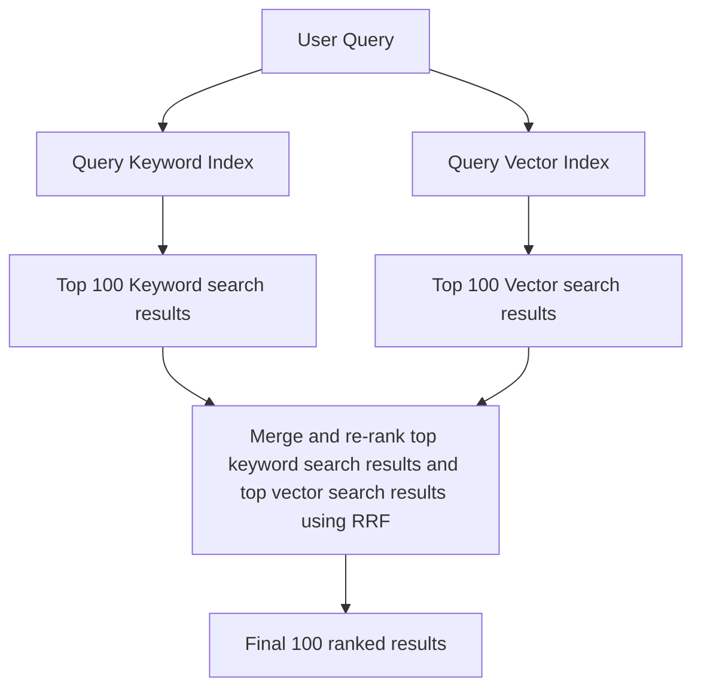

True Hybrid Search allows you to combine multiple retrieval techniques — such as multi-vector search, hybrid (vector \+ text) search
sort the results using a custom scoring function **within a single query**.

## How TopK differs from other "hybrid" search systems

Most databases that offer "hybrid" search maintain separate vector and keyword indexes. When a query is executed:

1. They run the query against both indexes separately
2. Then each index returns its top results (e.g. first 100 candidates)
3. Lastly, use techniques like Reciprocal Rank Fusion (RRF) to merge and re-rank these two sets of results

<br />



<br />

This approach is fundamentally **probabilistic** - the final "top 100" results are not guaranteed to be the actual best matches because some potential matches might be missed if they don't appear in either index's top results.

**TopK is different.** We scan both vector and keyword indexes simultaneously within a single query, ensuring that our "top 100" results are the **actual** top 100 - not just a probabilistic approximation.

With TopK, you can:

- Retrieve documents based on multiple embeddings -- **multi-vector retrieval**.
- Combine semantic similarity (or vector distance) with keyword search -- **true hybrid retrieval**.
- Apply custom scoring functions that blend multiple ranking factors -- **custom scoring**.

---

## Multi-Vector Retrieval

In some cases, a single vector representation of your content is not enough. For example, in a research paper database, you might want to:

- Retrieve documents based on both the summary of the entire paper and summaries of individual paragraphs.
- Rank results by combining scores from multiple embeddings.

Let's define a collection with two [semantic indexes](/collections/create#semantic-index):

<CodeGroup>

```python Python
from topk_sdk.schema import text, vector, semantic_index

client.collections().create(
    "papers",
    schema={
        "title": text().required(),
        "paper_summary": text().index(semantic_index()),  # Embedding of full paper
        "paragraph_summary": text().index(semantic_index()),  # Embedding of a paragraph
    },
)
```

Under the hood, TopK will create two separate vector


```typescript Javascript
import { text, semanticIndex } from "topk-js/schema";

await client.collections().create("papers", {
  title: text().required(),
  paper_summary: text().index(semanticIndex()), // Embedding of full paper
  paragraph_summary: text().index(semanticIndex()), // Embedding of a paragraph
});
```

</CodeGroup>

### Using semantic similarity

<CodeGroup>

```python Python
from topk_sdk.query import select, fn

docs = client.collection("papers").query(
    select(
        "title",
        paper_score=fn.semantic_similarity("paper_summary", "deep learning optimization"),
        paragraph_score=fn.semantic_similarity("paragraph_summary", "stochastic gradient descent")
    )
    .topk(field("paper_score") * 0.7 + field("paragraph_score") * 0.3, 10)
)
```


```javascript Javascript
import { select, field, fn } from "topk-js/query";

const docs = await client.collection("papers").query(
  select({
    title: field("title"),
    paper_score: fn.semanticSimilarity(
      "paper_summary",
      "deep learning optimization"
    ),
    paragraph_score: fn.semanticSimilarity(
      "paragraph_summary",
      "stochastic gradient descent"
    ),
  }).topk(
    field("paper_score").mul(0.7).add(field("paragraph_score").mul(0.3)),
    10
  )
);
```

</CodeGroup>

**Explanation**

- We retrieve documents based on both the full paper summary and the paragraph summary.
- The `topk()` function blends the two scores, giving 70% weight to the full paper and 30% weight to the paragraph.
- This method ensures that entirely relevant papers rank higher while also considering specific paragraph relevance.

---

## Vector \+ Text Retrieval (Hybrid Search)

Hybrid retrieval combines **semantic similarity (vector-based search)** with **exact keyword matching**. This ensures that documents containing **explicit matches** to the query keywords are considered alongside **semantic similarity**.

Let's define a collection with one [keyword index](/collections/create#keyword-index) and one [semantic index](/collections/create#semantic-index):

<CodeGroup>

```python Python
from topk_sdk.schema import text, semantic_index, keyword_index

client.collections().create(
    "articles",
    schema={
        "title": text().required().index(keyword_index()),  # Keyword-based retrieval
        "content": text().index(semantic_index()),  # Semantic search
    },
)
```


```typescript Javascript
import { text, semanticIndex, keywordIndex } from "topk-js/schema";

await client.collections().create("articles", {
  title: text().required().index(keywordIndex()), // Keyword-based retrieval
  content: text().index(semanticIndex()), // Semantic search
});
```

</CodeGroup>

In the following example we'll perform a hybrid retrieval that uses both keyword and semantic(vector) search:

<CodeGroup>

```python Python
from topk_sdk.query import select, fn, match

docs = client.collection("articles").query(
    select(
        "title",
        content_similarity=fn.semantic_similarity("content", "climate change policies"),
        text_score=fn.bm25_score()
    )
    .filter(match("carbon tax") | match("renewable energy"))  # Ensure keyword relevance
    .topk(field("content_similarity") * 0.6 + field("text_score") * 0.4, 10)
)
```


```typescript Javascript
import { select, fn, match } from "topk-js/query";

const docs = await client.collection("articles").query(
  select({
    title: field("title"),
    content_similarity: fn.semanticSimilarity(
      "content",
      "climate change policies"
    ),
    text_score: fn.bm25Score(),
  })
    .filter(match("carbon tax").or(match("renewable energy"))) // Ensure keyword relevance
    .topk(
      field("content_similarity").mul(0.6).add(field("text_score").mul(0.4)),
      10
    )
);
```

</CodeGroup>

**Explanation**

- We retrieve documents based on semantic meaning (`content_score`) and keyword matching (`keyword_match`).
- The `filter()` ensures that documents must contain at least one relevant keyword.
- The `topk()` function weights the scores, prioritizing semantic meaning (60%) while still considering keyword matches (40%).

This **balances precision and recall**, capturing both **exact keyword matches** and **meaningful context**.

---

## Custom Scoring Functions

TopK allows you to **define powerful scoring functions** by combining semantic similarity with additional fields, such as a **precomputed importance score**.

### Defining a Collection with Custom Scoring Fields

<CodeGroup>

```python Python
from topk_sdk.schema import text, float, semantic_index

client.collections().create(
    "documents",
    schema={
        "content": text().index(semantic_index()),  # Semantic search
        "importance": float().required(),  # Precomputed importance score
    },
)
```


```typescript Javascript
import { text, float, semanticIndex } from "topk-js/schema";

await client.collections().create("documents", {
  content: text().index(semanticIndex()), // Semantic search
  importance: float().required(), // Precomputed importance score
});
```

</CodeGroup>

### Querying with a Custom Scoring Function

<CodeGroup>

```python Python
from topk_sdk.query import select, fn

docs = client.collection("documents").query(
    select(
        content_score=fn.semantic_similarity("content", "machine learning applications"),
    )
    .topk(0.8 * field("importance") + 0.2 * field("content_score"), 10)
)
```


```typescript Javascript
import { select, fn, literal } from "topk-js/query";

const docs = await client.collection("documents").query(
  select({
    content_score: fn.semanticSimilarity(
      "content",
      "machine learning applications"
    ),
  }).topk(
    literal(0.8)
      .mul(field("importance"))
      .add(field("content_score").mul(0.2)),
    10
  )
);
```

</CodeGroup>

**Explanation**

- We retrieve documents based on both semantic similarity (`content_score`) and precomputed importance (`importance_score`).
- The `topk()` function gives 80% weight to content relevance and 20% weight to document importance.
- This method allows you to boost more critical documents, ensuring that highly relevant but less "important" content doesn't dominate.