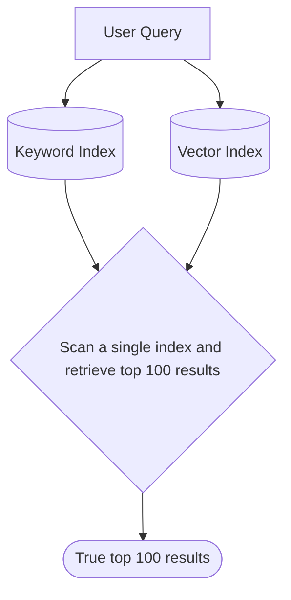

With TopK's true hybrid search, you can combine multiple retrieval techniques such as:

* vector search
* multi-vector search
* keyword search
* metadata filtering

-- all in a single query.

## How TopK differs from other "hybrid" search systems

Most databases that offer hybrid search maintain separate vector and keyword indexes. When a query is executed they:

1. Run two separate queries for both indexes
2. Collect the top results from each query (e.g. first 100 + 100 candidates)
3. Use techniques like Reciprocal Rank Fusion (RRF) to merge and rerank these two sets of results

<br />


<br />

This approach is fundamentally **probabilistic** - the final top-k results are not guaranteed to be the actual best candidates because some potential candidates might be missed if they don't appear in either index's top results.

**TopK is different.** It runs through a single index(vector \+ keyword), ensuring that our "top 100" results are the **actual** top 100 - not just a probabilistic approximation:



With TopK, you can:

- Retrieve documents based on multiple embeddings -- **Multi-vector retrieval**
- Combine semantic similarity(e.g vector search) with keyword search -- **True Hybrid Retrieval**
- **Filter documents** by their metadata
- Apply custom scoring functions blending multiple ranking factors -- **Custom scoring**

## Implementing Hybrid Search (Vector \+ Keyword)

Hybrid retrieval combines **semantic similarity (vector-based search)** with **exact keyword matching**. This approach ensures that documents with **direct keyword matches** are considered alongside those that are **semantically similar** to the query.

Let's define a collection with one [`keyword_index()`](/collections/create#keyword-index) and one [`semantic_index()`](/collections/create#semantic-index):

<CodeGroup>

```python Python
from topk_sdk.schema import text, keyword_index, semantic_index

client.collections().create(
    "articles",
    schema={
        "title": text().required().index(keyword_index()),  # Keyword-based retrieval
        "content": text().index(semantic_index()),  # Semantic search
    },
)
```


```typescript Javascript
import { text, keywordIndex, semanticIndex } from "topk-js/schema";

await client.collections().create("articles", {
  title: text().required().index(keywordIndex()), // Keyword-based retrieval
  content: text().index(semanticIndex()), // Semantic search
});
```

</CodeGroup>

In the following example we'll perform a hybrid search that combines keyword and vector(semantic) search in a single query:

<CodeGroup>

```python Python
from topk_sdk.query import select, field, fn, match

docs = client.collection("articles").query(
    select(
        "title",
        content_similarity=fn.semantic_similarity("content", "climate change policies"),
        text_score=fn.bm25_score(),
    )
    .filter(match("carbon") | match("renewable energy"))  # Ensure keyword relevance
    .topk(field("content_similarity") * 0.6 + field("text_score") * 0.4, 10)
)
```


```typescript Javascript
import { select, field, fn, match } from "topk-js/query";

const docs = await client.collection("articles").query(
  select({
    title: field("title"),
    content_similarity: fn.semanticSimilarity(
      "content",
      "climate change policies"
    ),
    text_score: fn.bm25Score(),
  })
    .filter(match("carbon").or(match("renewable energy"))) // Ensure keyword relevance
    .topk(
      field("content_similarity").mul(0.6).add(field("text_score").mul(0.4)),
      10
    )
);
```

</CodeGroup>

Let's break down the example above:

- We retrieve documents based on semantic meaning (`content_similarity`) and keyword matching (`text_score`).
- The `filter()` ensures that documents contain at least one relevant keyword.
- The `topk()` function weights the scores, prioritizing semantic meaning (60%) while still considering keyword matches (40%).

This **balances precision and recall**, capturing both **exact keyword matches** and **meaningful context**.

## Implementing Complex Search(Keyword \+ Vector \+ Filtering \+ Reranking)

In TopK, you can combine [keyword search](/concepts/keyword-search), [vector search](/concepts/vector-search), [filtering](/documents/query#filtering) and [reranking](/concepts/reranking) in a single query.
This allows you to fetch the truly **most relevant results** while maintaining a steady performance - no overfetching.

<CodeGroup>

```python Python
from topk_sdk.query import select, field, fn, match

docs = client.collection("books").query(
    select(
        "title",
        # Score documents using BM25 algorithm
        text_score=fn.bm25_score(),
        # Compute semantic similarity between the provided query and the `title` field.
        title_similarity=fn.semantic_similarity("title", "catcher"),
    )
    # Filter documents that contain the `great` keyword
    .filter(match("great"))
    # Filtering by metadata
    .filter(field("published_year") > 1980)
    # Return top 10 documents with the highest combined score
    .topk(field("text_score") * 0.2 + field("title_similarity") * 0.8, 10)
    # Rerank the documents
    .rerank()
)
```


```typescript Javascript
import { select, fn, field, match } from "topk-js/query";

const docs = await client.collection("books").query(
  select({
    title: field("title"),
    text_score: fn.bm25Score(),
    title_similarity: fn.semanticSimilarity("title", "catcher"),
  })
    .filter(match("great"))
    .filter(field("published_year").gt(1980))
    .topk(
      field("text_score").mul(0.2).add(field("title_similarity").mul(0.8)),
      10
    )
    .rerank()
);
```

</CodeGroup>

As you might have noticed, we are also sorting the top-k results using a custom scoring function.
You can read more about custom scoring functions in the following section.

## Custom Scoring Functions

TopK allows you to **define custom scoring functions** by combining:

- Semantic similarity score
- Keyword score(BM25)
- Vector distance
- "Bring-your-own" precomputed importance score

### Defining a Collection with Custom Scoring Fields

<CodeGroup>

```python Python
from topk_sdk.schema import text, float, semantic_index

client.collections().create(
    "documents",
    schema={
        "content": text().index(semantic_index()),  # Semantic search
        "importance": float().required(),  # Precomputed importance score
    },
)
```


```typescript Javascript
import { text, float, semanticIndex } from "topk-js/schema";

await client.collections().create("documents", {
  content: text().index(semanticIndex()), // Semantic search
  importance: float().required(), // Precomputed importance score
});
```

</CodeGroup>

### Querying with a Custom Scoring Function

<CodeGroup>

```python Python
from topk_sdk.query import select, field, fn

docs = client.collection("documents").query(
    select(
        content_score=fn.semantic_similarity("content", "machine learning applications"),
    )
    .topk(0.8 * field("importance") + 0.2 * field("content_score"), 10)
)
```


```typescript Javascript
import { select, field, fn } from "topk-js/query";

const docs = await client.collection("documents").query(
  select({
    content_score: fn.semanticSimilarity(
      "content",
      "machine learning applications"
    ),
  }).topk(
    field("importance").mul(0.8).add(field("content_score").mul(0.2)),
    10
  )
);
```

</CodeGroup>

Let's break down the example above:

1. First, we retrieve documents based on both semantic similarity (`content_score`) and precomputed importance (`importance_score`).
2. Then, the `topk()` function gives 80% weight to content score and 20% weight to document importance.
3. Sorting by a custom scoring function allows us to boost more critical documents, ensuring that highly relevant but less "important" content doesn't dominate.