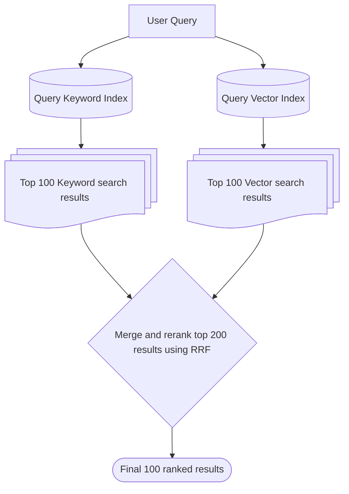
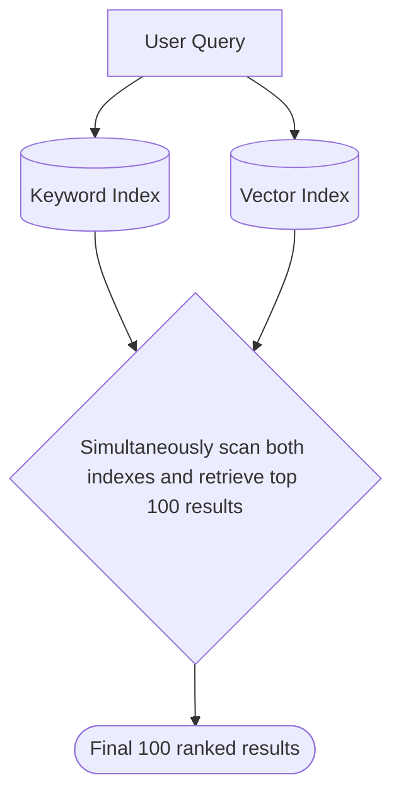

True Hybrid Search allows you to combine multiple retrieval techniques — such as multi-vector search, hybrid (vector \+ text) search
sort the results using a custom scoring function **within a single query**.

## How TopK differs from other "hybrid" search systems

Most databases that offer "hybrid" search maintain separate vector and keyword indexes. When a query is executed:

1. They run the query against both indexes separately
2. Then each index returns its top results (e.g. first 100 candidates)
3. Lastly, use techniques like Reciprocal Rank Fusion (RRF) to merge and rerank these two sets of results

<br />



<br />

This approach is fundamentally **probabilistic** - the final "top 100" results are not guaranteed to be the actual best matches because some potential matches might be missed if they don't appear in either index's top results.

**TopK is different.** We scan both vector and keyword indexes simultaneously within a single query, ensuring that our "top 100" results are the **actual** top 100 - not just a probabilistic approximation:




With TopK, you can:

- Retrieve documents based on multiple embeddings -- **multi-vector retrieval**
- Combine semantic similarity (or vector distance) with keyword search -- **true hybrid retrieval**
- Filter documents to enforce hard constraints -- **metadata filtering**
- Apply custom scoring functions blending multiple ranking factors -- **custom scoring**


## Implementing hybrid search(vector + keyword)

Hybrid retrieval combines **semantic similarity (vector-based search)** with **exact keyword matching**. This ensures that documents containing **explicit matches** to the query keywords are considered alongside **semantic similarity**.

Let's define a collection with one [keyword index](/collections/create#keyword-index) and one [semantic index](/collections/create#semantic-index):

<CodeGroup>

```python Python
from topk_sdk.schema import text, semantic_index, keyword_index

client.collections().create(
    "articles",
    schema={
        "title": text().required().index(keyword_index()),  # Keyword-based retrieval
        "content": text().index(semantic_index()),  # Semantic search
    },
)
```


```typescript Javascript
import { text, semanticIndex, keywordIndex } from "topk-js/schema";

await client.collections().create("articles", {
  title: text().required().index(keywordIndex()), // Keyword-based retrieval
  content: text().index(semanticIndex()), // Semantic search
});
```

</CodeGroup>

In the following example we'll perform a hybrid search that uses both keyword and semantic(vector) search:

<CodeGroup>

```python Python
from topk_sdk.query import select, fn, match

docs = client.collection("articles").query(
    select(
        "title",
        content_similarity=fn.semantic_similarity("content", "climate change policies"),
        text_score=fn.bm25_score()
    )
    .filter(match("carbon tax") | match("renewable energy"))  # Ensure keyword relevance
    .topk(field("content_similarity") * 0.6 + field("text_score") * 0.4, 10)
)
```


```typescript Javascript
import { select, fn, match } from "topk-js/query";

const docs = await client.collection("articles").query(
  select({
    title: field("title"),
    content_similarity: fn.semanticSimilarity(
      "content",
      "climate change policies"
    ),
    text_score: fn.bm25Score(),
  })
    .filter(match("carbon tax").or(match("renewable energy"))) // Ensure keyword relevance
    .topk(
      field("content_similarity").mul(0.6).add(field("text_score").mul(0.4)),
      10
    )
);
```

</CodeGroup>

Let's break down the above example:

- We retrieve documents based on semantic meaning (`content_score`) and keyword matching (`keyword_match`).
- The `filter()` ensures that documents must contain at least one relevant keyword.
- The `topk()` function weights the scores, prioritizing semantic meaning (60%) while still considering keyword matches (40%).

This **balances precision and recall**, capturing both **exact keyword matches** and **meaningful context**.


## Keyword search + vector search + metadata filtering + reranking in a single query

You can combine keyword search, vector search, filtering, and reranking in a single query. Some people refer to this as a hybrid search and we believe it can provide you with the best and most relevant search results:

<CodeGroup>

```python Python
from topk_sdk.query import select, fn, match

docs = client.collection("books").query(
    select(
        "title",
        # Score documents using BM25 algorithm
        text_score=fn.bm25_score()
        # Compute semantic similarity between the provided query and the `title` field.
        title_similarity=fn.semantic_similarity("title", "catcher")
    )
    # Filter documents that contain the `great` keyword
    .filter(match("great"))
    # Filtering by metadata
    .filter(field("published_year") > 1980)
    # Return top 10 documents with the highest combined score
    .topk(field("text_score") * 0.2 + field("title_similarity") * 0.8, 10)
    # Rerank the documents
    .rerank()
)
```


```typescript Javascript
import { select, fn, field, match } from "topk-js/query";

const docs = await client.collection("books").query(
  select({
    title: field("title"),
    text_score: fn.bm25Score(),
    title_similarity: fn.semanticSimilarity("title", "catcher"),
  })
    .filter(match("great"))
    .filter(field("published_year").gt(1980))
    .topk(
      field("text_score").mul(0.2).add(field("title_similarity").mul(0.8)),
      10
    )
    .rerank()
);
```

</CodeGroup>

## Custom Scoring Functions

TopK allows you to **define powerful scoring functions** by combining semantic similarity with additional fields, such as a **precomputed importance score**.

### Defining a Collection with Custom Scoring Fields

<CodeGroup>

```python Python
from topk_sdk.schema import text, float, semantic_index

client.collections().create(
    "documents",
    schema={
        "content": text().index(semantic_index()),  # Semantic search
        "importance": float().required(),  # Precomputed importance score
    },
)
```


```typescript Javascript
import { text, float, semanticIndex } from "topk-js/schema";

await client.collections().create("documents", {
  content: text().index(semanticIndex()), // Semantic search
  importance: float().required(), // Precomputed importance score
});
```

</CodeGroup>

### Querying with a Custom Scoring Function

<CodeGroup>

```python Python
from topk_sdk.query import select, fn

docs = client.collection("documents").query(
    select(
        content_score=fn.semantic_similarity("content", "machine learning applications"),
    )
    .topk(0.8 * field("importance") + 0.2 * field("content_score"), 10)
)
```


```typescript Javascript
import { select, fn, literal } from "topk-js/query";

const docs = await client.collection("documents").query(
  select({
    content_score: fn.semanticSimilarity(
      "content",
      "machine learning applications"
    ),
  }).topk(
    literal(0.8)
      .mul(field("importance"))
      .add(field("content_score").mul(0.2)),
    10
  )
);
```

</CodeGroup>

Let's break down the above example:

1. First, we retrieve documents based on both semantic similarity (`content_score`) and precomputed importance (`importance_score`).
2. Then, the `topk()` function gives 80% weight to content relevance and 20% weight to document importance.
3. Sorting by a custom scoring function allows us to boost more critical documents, ensuring that highly relevant but less "important" content doesn't dominate.