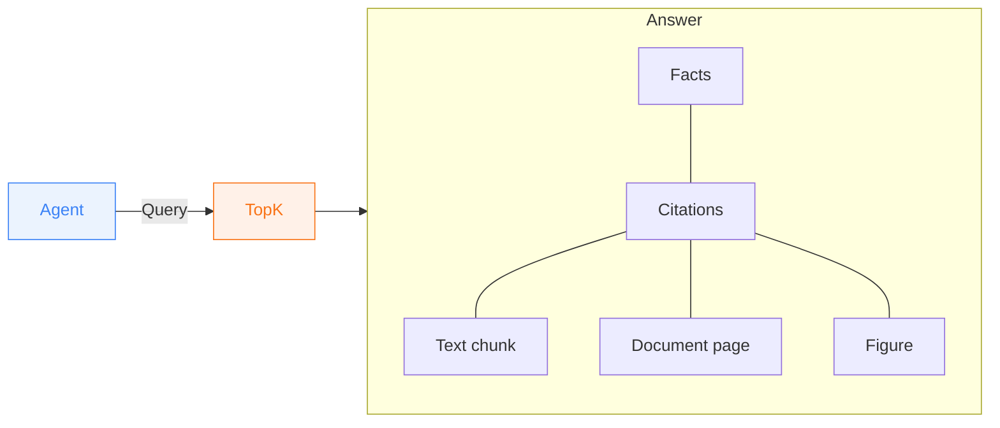

TopK answers natural-language queries over your documents.
It retrieves the most relevant parts of your documents and synthesizes a grounded answer with source citations.



## How it works

When you run an Agent Search, TopK:

<Steps>
  <Step title="Searches your documents">
    Your documents are searched to find the most relevant passages based on your query.
  </Step>
  <Step title="Generates a grounded answer">
    It produces a grounded answer based on the retrieved evidence.
  </Step>
  <Step title="Returns answer with source citations">
    It returns an answer with source citations so the answer can be verified.
  </Step>
</Steps>

Here's an example of Agent Search for a financial/legal knowledge base:

<Info>
**Query:**

Based on the acquisition agreement and recent SEC filings, what are the main risks to the Vertex deal closing on time?

**Answer:**
- The European Commission's approval is conditional on divestiture of the logistics subsidiary within 90 days of closing, creating a tight execution window. <Badge color="purple">0\_0</Badge> <Badge color="purple">1\_0</Badge>
- The $1.8B consideration is subject to an unresolved working capital adjustment mechanism that could delay closing if the parties fail to agree on the final figure. <Badge color="purple">0\_1</Badge>
- An 18-month earnout tied to Vertex's ARR targets introduces post-close execution risk; if milestones are missed, the deal economics shift materially for both parties. <Badge color="purple">2\_0</Badge>

**Citations:**
- <Badge color="purple">0\_0</Badge> — "Buyer shall procure the divestiture of the European logistics subsidiary no later than ninety (90) days following the Closing Date…"
  <Badge color="blue">vertex-acquisition-agreement.pdf</Badge>
- <Badge color="purple">0\_1</Badge> — Consideration structure and working capital adjustment table, p. 4
  <Badge color="blue">vertex-acquisition-agreement.pdf</Badge>
- <Badge color="purple">1\_0</Badge> — "The European Commission has indicated that approval is contingent upon structural remedies including divestiture of logistics assets…"
  <Badge color="blue">sec-filing-8k.html</Badge>
- <Badge color="purple">2\_0</Badge> — Closing timeline and earnout milestone diagram
  <Badge color="blue">deal-timeline.png</Badge>
</Info>

As you can see, not only does TopK understand your data and the relationships within it,
but it also understands queries and reasons about answers—all grounded in your source material.

This makes Agent Search useful for:

- **answering questions** over internal knowledge bases
- **comparing facts** across reports, contracts, or policies
- **grounding agents** in private document context
- **summarizing** what your documents say about a topic

## Basic usage

Once a dataset is created and your documents are processed, you can start running agentic queries against your documents:

<Tabs>
  <Tab title="CLI" icon="terminal">
    ```bash
    topk ask "What are the key findings?" -d my-docs
    ```
  </Tab>
  <Tab title="Python SDK" icon="/icons/python.svg">
    ```python
    answer = client.ask("What are the key findings?", ["my-docs"])

    print(answer)
    ```
  </Tab>
  <Tab title="JavaScript SDK" icon="/icons/js.svg">
    ```typescript
    const answer = await client.ask("What are the key findings?", ["my-docs"]);

    console.log(answer);
    ```
  </Tab>
</Tabs>

## Narrowing search scope

At least one dataset must be provided. When you need to query across multiple datasets or want to restrict results to a specific one, you can pass multiple datasets or attach filters to them.

### Scoping to specific datasets

This is useful when you want:

- faster and more targeted answers
- less ambiguity across unrelated document sets
- tighter control over what context an agent is allowed to use

<Tabs>
  <Tab title="CLI" icon="terminal">
    Use `-d` / `--dataset` (repeatable) to specify the datasets to search:

    ```bash
    topk ask "What changed in the refund policy?" -d policies -d handbooks
    ```
  </Tab>
  <Tab title="Python SDK" icon="/icons/python.svg">
    Pass the dataset names as the second argument as a list:

    ```python
    answer = client.ask(
        "What changed in the refund policy?",
        ["policies", "handbooks"],
    )
    ```
  </Tab>
  <Tab title="JavaScript SDK" icon="/icons/js.svg">
    Pass the dataset names as the second argument as a list:

    ```typescript
    const answer = await client.ask(
      "What changed in the refund policy?",
      ["policies", "handbooks"],
    );
    ```
  </Tab>
</Tabs>

### Filter documents

Sometimes a dataset is still too broad. In the SDKs, you can narrow a source further by attaching a filter expression to that source.

These filter expressions operate on the **metadata fields** of documents in that dataset. For example, if you uploaded documents with metadata such as `department`, `year`, `doc_type`, or `author`, you can use those fields to limit what Agent Search is allowed to retrieve.

This is useful when you want to ask things like:

- only within 2024 documents
- only within HR policies
- only within documents authored by a specific team

<Tabs>
  <Tab title="Python SDK" icon="/icons/python.svg">
    ```python
    from topk_sdk.query import field

    answer = client.ask(
        "What is the travel reimbursement limit?",
        [
            {
                "dataset": "policies",
                "filter": field("department").eq("finance").and_(
                    field("year").eq(2024)
                ),
            }
        ],
    )
    ```
  </Tab>
  <Tab title="JavaScript SDK" icon="/icons/js.svg">
    ```typescript
    import { field } from "topk-js/query";

    const answer = await client.ask(
      "What is the travel reimbursement limit?",
      [
        {
          dataset: "policies",
          filter: field("department").eq("finance").and(field("year").eq(2024)),
        },
      ],
    );
    ```
  </Tab>
</Tabs>

Use source-level filters when the restriction is part of where the answer should come from. That keeps retrieval focused and makes the resulting citations more precise.

## Working with the answer

An Agent Search result is designed to be useful immediately. It is not just text to read. It is a structured answer backed by evidence from your documents.

An Agent Search result returns:

- **facts** - the answer broken into grounded factual statements, with citation identifiers attached to each fact
- **citations** - references to the underlying source documents and passages

That structure is what makes Agent Search valuable:

- humans can verify where a statement came from
- agents can decide whether the evidence is strong enough to act on
- applications can render answers and supporting evidence together

The important property is that Agent Search returns **facts with citations**, not unsupported free-form generation.

For example, if the query is:

```text
What does the policy say about contractor access?
```

you can think of the final Agent Search result like this:

```json title="Example Agent Search response" expandable
{
  "facts": [
    {
      "fact": "Contractors may access internal systems only with approved, time-limited credentials.",
      "ref_ids": ["0_0"]
    },
    {
      "fact": "Contractor access must be sponsored by an employee and reviewed regularly.",
      "ref_ids": ["0_1", "1_0"]
    }
  ],
  "refs": {
    "0_0": {
      "doc_id": "vendor-access-policy",
      "doc_type": "application/pdf",
      "dataset": "policies",
      "content": {
        "chunk": {
          "text": "Contractors may be granted access only through approved, time-limited credentials.",
          "doc_pages": [4]
        }
      },
      "metadata": {
        "title": "Vendor Access Policy"
      }
    },
    "0_1": {
      "doc_id": "vendor-access-policy",
      "doc_type": "application/pdf",
      "dataset": "policies",
      "content": {
        "chunk": {
          "text": "All contractor access must be sponsored by a full-time employee.",
          "doc_pages": [5]
        }
      },
      "metadata": {
        "title": "Vendor Access Policy"
      }
    },
    "1_0": {
      "doc_id": "security-standards",
      "doc_type": "text/markdown",
      "dataset": "policies",
      "content": {
        "chunk": {
          "text": "Managers must review third-party access on a recurring basis.",
          "doc_pages": []
        }
      },
      "metadata": {
        "title": "Security Standards"
      }
    }
  }
}
```

In this example, each fact points to one or more `ref_ids`, and those IDs map to the supporting document passages in `refs`.

## Retrieving documents metadata

Often, the answer alone is not enough. You may also want metadata on the cited documents, such as title, author, date, category, or any custom metadata fields you attached during upload.

That is especially useful when you want to:

- render richer citations in a UI
- show document titles alongside facts
- group answers by source attributes like year, author, or department
- let agents carry document metadata into downstream workflows

<Tabs>
  <Tab title="CLI" icon="terminal">
    Use `--field` (repeatable):

    ```bash
    topk ask "What changed in the refund policy?" -d policies --field title --field author --field year
    ```
  </Tab>
  <Tab title="Python SDK" icon="/icons/python.svg">
    Use `select_fields`:

    ```python
    answer = client.ask(
        "What changed in the refund policy?",
        ["policies"],
        select_fields=["title", "author", "year"],
    )
    ```
  </Tab>
  <Tab title="JavaScript SDK" icon="/icons/js.svg">
    Use `selectFields`:

    ```typescript
    const answer = await client.ask(
      "What changed in the refund policy?",
      ["policies"],
      { selectFields: ["title", "author", "year"] },
    );
    ```
  </Tab>
</Tabs>

The returned metadata appears on the cited results, so you can display it next to the supporting passages.

## Understanding citations

Citations are the evidence trail for the answer. They link each fact back to the document passages that support it.

A citation helps you identify:

- which document supported the claim
- which passage, section, or chunk was used
- any returned metadata you asked TopK to include

For humans, this means you can:

- verify that an answer is correct
- open the original document and inspect the relevant section
- compare how strongly different sources support a claim

For agents, this means you can:

- decide whether there is enough evidence to proceed
- attach evidence to downstream actions or reports
- ask follow-up questions against the cited documents

As a rule, if a statement matters, check the citation behind it. That is what makes Agent Search reliable enough to build on.

## Choosing between Agent Search, Search, and Research

- Use [Agent Search](/core/agent-search) when you want the fastest path from documents to a grounded answer with citations.
- Use [Document Search](/core/search) when you want the most relevant passages and prefer to inspect the evidence yourself.
- Use [Research](/core/research) when the question is broad, exploratory, or requires deeper multi-step analysis across many documents.
