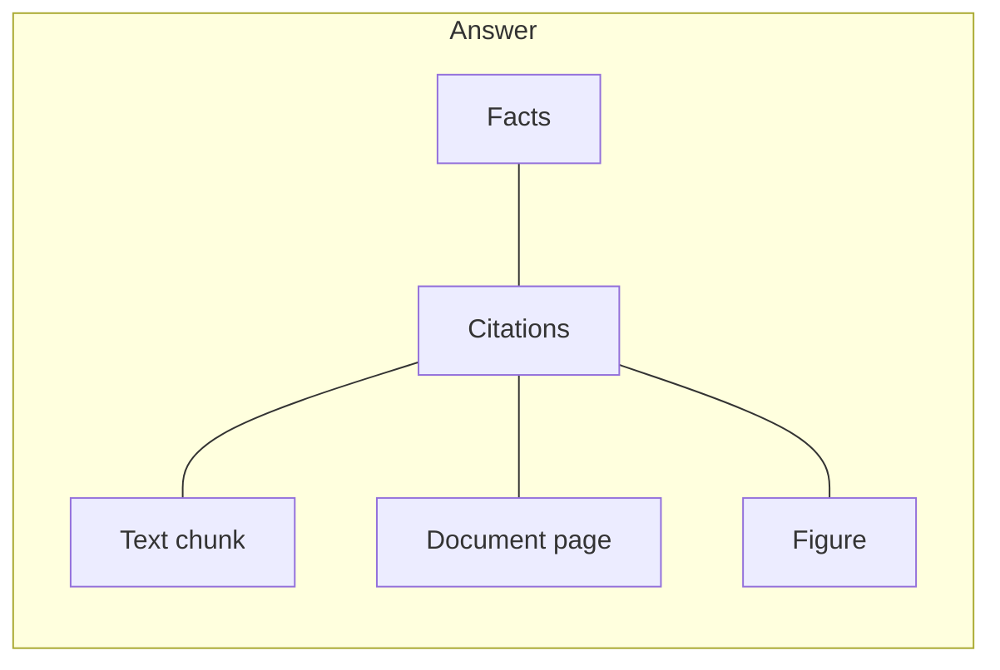

TopK answers natural-language queries over your documents.
It retrieves the most relevant parts of your documents and synthesizes a grounded answer with source citations.



## How it works

When you run Ask:

<Steps>
  <Step title="Understands your query">
    TopK interprets your question and organizes it into a clear sequence of answerable steps
  </Step>
  <Step title="Searches your documents">
    Your documents are searched to find the most relevant passages based on your query.
  </Step>
  <Step title="Generates a grounded answer">
    Produce a grounded answer based on the retrieved evidence.
  </Step>
  <Step title="Returns answer with source citations">
    Get a verifiable answer backed by source citations
  </Step>
</Steps>

Here's an example of Ask query for a financial/legal knowledge base:

<Info>
**Query:**

Based on the acquisition agreement and recent SEC filings, what are the main risks to the Vertex deal closing on time?

**Answer:**
- The European Commission's approval is conditional on divestiture of the logistics subsidiary within 90 days of closing, creating a tight execution window. <Badge color="purple">0\_0</Badge> <Badge color="purple">1\_0</Badge>
- The $1.8B consideration is subject to an unresolved working capital adjustment mechanism that could delay closing if the parties fail to agree on the final figure. <Badge color="purple">0\_1</Badge>
- An 18-month earnout tied to Vertex's ARR targets introduces post-close execution risk; if milestones are missed, the deal economics shift materially for both parties. <Badge color="purple">2\_0</Badge>

**Citations:**
- <Badge color="purple">0\_0</Badge> — "Buyer shall procure the divestiture of the European logistics subsidiary no later than ninety (90) days following the Closing Date…"
  <Badge color="blue">vertex-acquisition-agreement.pdf</Badge>
- <Badge color="purple">0\_1</Badge> — Consideration structure and working capital adjustment table, p. 4
  <Badge color="blue">vertex-acquisition-agreement.pdf</Badge>
- <Badge color="purple">1\_0</Badge> — "The European Commission has indicated that approval is contingent upon structural remedies including divestiture of logistics assets…"
  <Badge color="blue">sec-filing-8k.html</Badge>
- <Badge color="purple">2\_0</Badge> — Closing timeline and earnout milestone diagram
  <Badge color="blue">deal-timeline.png</Badge>
</Info>

As you can see, not only does TopK understand your data and the relationships within it,
but it also understands queries and reasons about answers—all grounded in your source material.

This makes Ask useful for:

- **answering questions** over internal knowledge bases
- **comparing facts** across reports, contracts, or policies
- **grounding agents** in private document context
- **summarizing** what your documents say about a topic

## Usage

Once a dataset is created and your documents are processed, you can start running agentic queries against your documents:

<Tabs>
  <Tab title="CLI" icon="terminal">
    ```bash
    topk ask "What was the total net income of Bank of America in 2024?" -d my-docs
    ```
  </Tab>
  <Tab title="Python SDK" icon="/icons/python.svg">
    ```python
    answer = client.ask("What was the total net income of Bank of America in 2024?", ["my-docs"])

    print(answer)
    ```
  </Tab>
  <Tab title="JavaScript SDK" icon="/icons/js.svg">
    ```typescript
    const answer = await client.ask("What was the total net income of Bank of America in 2024?", ["my-docs"]);

    console.log(answer);
    ```
  </Tab>
</Tabs>

Each answer includes:

- **facts** — individual statements answering the query, backed by source citations
- **refs** — citations associated with each fact, linking back to the supporting documents

## Scoping the query

Query across multiple datasets or apply document filters to narrow the scope of the query.

### Scoping to specific datasets

This is useful when you want:

- More targeted answers
- Less ambiguity across unrelated document sets
- Tighter control over what context an agent is allowed to use

<Tabs>
  <Tab title="CLI" icon="terminal">
    To specify the datasets to query against, pass `--dataset` or `-d` (repeatable):

    ```bash
    topk ask "What was the total net income of Bank of America in 2024?" -d finance -d compliance
    ```
  </Tab>
  <Tab title="Python SDK" icon="/icons/python.svg">
    To specify the datasets to query against, pass the dataset names as the second argument as a list:

    <CodeGroup>
      ```python Sync
      import os
      from topk_sdk import Client

      client = Client(
          api_key=os.environ.get("TOPK_API_KEY"),
          region="aws-us-east-1-elastica",
      )

      answer = client.ask(
          "What was the total net income of Bank of America in 2024?",
          ["finance", "compliance"],  # list of dataset names to query against
      )
      ```
      ```python Async
      import os
      from topk_sdk import AsyncClient

      client = AsyncClient(
          api_key=os.environ.get("TOPK_API_KEY"),
          region="aws-us-east-1-elastica",
      )

      answer = await client.ask(
          "What was the total net income of Bank of America in 2024?",
          ["finance", "compliance"],  # list of dataset names to query against
      )
      ```
    </CodeGroup>
  </Tab>
  <Tab title="JavaScript SDK" icon="/icons/js.svg">
    To specify the datasets to query against, pass the dataset names as the second argument as a list:

    ```typescript
    import { Client } from "topk-js";

    const client = new Client({
      apiKey: process.env.TOPK_API_KEY,
      region: "aws-us-east-1-elastica",
    });

    const answer = await client.ask(
      "What was the total net income of Bank of America in 2024?",
      ["finance", "compliance"], # list of dataset names to query against
    );
    ```
  </Tab>
</Tabs>

### Document filtering

Sometimes a dataset might contain documents that should not be considered for the query. You can filter out documents that don't match your criteria by providing a [filter expression](/documents/query#filtering).

These filter expressions operate on the **metadata fields** of documents.

For example, if you uploaded documents with metadata such as `department`, `year`, `doc_type`, or `author`, you can use those fields to limit what Ask is allowed to retrieve.

This is useful when you want to query:

- Documents within a specific time range
- Documents matching a particular category or type
- Documents associated with a specific group or owner
- Documents the user is permitted to access

<Tabs>
  <Tab title="Python SDK" icon="/icons/python.svg">
    <CodeGroup>
      ```python Sync
      import os
      from topk_sdk import Client
      from topk_sdk.query import field

      client = Client(
          api_key=os.environ.get("TOPK_API_KEY"),
          region="aws-us-east-1-elastica",
      )

      answer = client.ask(
          "What is the travel reimbursement limit?",
          [
              {
                  "dataset": "policies",
                  "filter": field("department").eq("finance").and_(
                      field("year").eq(2024)
                  ),
              }
          ],
      )
      ```
      ```python Async
      import os
      from topk_sdk import AsyncClient
      from topk_sdk.query import field

      client = AsyncClient(
          api_key=os.environ.get("TOPK_API_KEY"),
          region="aws-us-east-1-elastica",
      )

      answer = await client.ask(
          "What is the travel reimbursement limit?",
          [
              {
                  "dataset": "policies",
                  "filter": field("department").eq("finance").and_(
                      field("year").eq(2024)
                  ),
              }
          ],
      )
      ```
    </CodeGroup>
  </Tab>
  <Tab title="JavaScript SDK" icon="/icons/js.svg">
    ```typescript
    import { field } from "topk-js/query";

    const answer = await client.ask(
      "What is the travel reimbursement limit?",
      [
        {
          dataset: "policies",
          filter: field("department").eq("finance").and(field("year").eq(2024)),
        },
      ],
    );
    ```
  </Tab>
</Tabs>

Apply source filters when you want answers to come from specific sources.
This keeps results focused and easier to verify.

## Retrieving documents metadata

You may also want to retrieve metadata on the cited documents, such as title, author, date, category, or any custom metadata fields you attached during upload.

That is especially useful when you want to:

- Show document titles alongside facts
- Group answers by source attributes like year, author, or department
- Let agents carry document metadata into downstream workflows
- Render richer citations in a UI

<Tabs>
  <Tab title="CLI" icon="terminal">
    Use `--field` (repeatable) flag to include metadata field(s):

    ```bash
    topk ask "What was the total net income of Bank of America in 2024?" -d finance --field title --field author --field year
    ```
  </Tab>
  <Tab title="Python SDK" icon="/icons/python.svg">
    Use `select_fields` parameter to include metadata field(s):

    ```python
    answer = client.ask(
        "What was the total net income of Bank of America in 2024?",
        ["policies"],
        select_fields=["title", "author", "year"],
    )
    ```
  </Tab>
  <Tab title="JavaScript SDK" icon="/icons/js.svg">
    Use `selectFields` parameter to include metadata field(s):

    ```typescript
    const answer = await client.ask(
      "What was the total net income of Bank of America in 2024?",
      ["policies"],
      { selectFields: ["title", "author", "year"] },
    );
    ```
  </Tab>
</Tabs>

The returned metadata appears on the cited results, which are associated with each fact.

## Understanding citations

Citations are the evidence trail for the answer. They link each fact back to the original document passages that support it.

A citation helps you identify:

- Which document supported the claim
- Which passage, section, or chunk was used
- Any returned metadata you asked TopK to include

**For humans**, this means you can:

- Verify that an answer is correct
- Open the original document and inspect the relevant section
- Compare how strongly different sources support a claim

**For agents**, this means you can:

- Decide whether there is enough evidence to proceed
- Attach evidence to downstream actions or reports
- Ask follow-up questions against the cited documents
