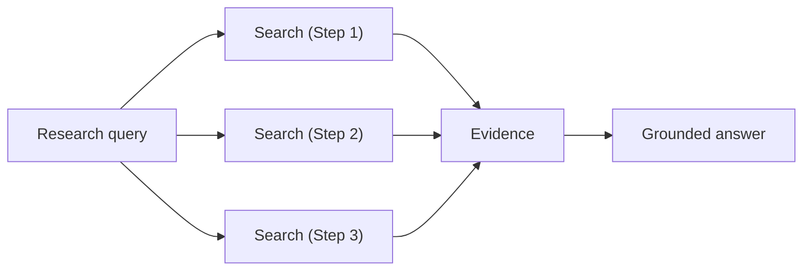

Research turns complex queries into a series of targeted searches, gathers evidence across documents, and produces a grounded answer with source citations.



## How it works

When you run a Research query, TopK:

<Steps>
  <Step title="Understands the query">
    Research interprets the query in context, including the evidence gathered so far.
  </Step>
  <Step title="Breaks it into smaller tasks">
    It decomposes the problem into focused sub-queries.
  </Step>
  <Step title="Searches for relevant evidence">
    It runs targeted searches across your data to find the most relevant information.
  </Step>
  <Step title="Extracts grounded facts">
    It pulls out concrete, source-backed facts from each result, preserving citations.
  </Step>
  <Step title="Produces the final answer">
    It combines the gathered evidence, performing comparisons or aggregations when needed, to produce a single, grounded answer with citations.
  </Step>
</Steps>

Here's an example of a Research query over financial filings:

<Info>
**Query:**

What was the 2022 and 2023 total value of commercial loans modified as TDRs, and the total 90+ days past due for consumer loans at December 31, 2024?

**Answer:**

- Based on exact phrasing matches to corporate filings, the question refers to Bank of America. During 2022, the carrying value of Bank of America's commercial loans modified as Troubled Debt Restructurings (TDRs) was \$1.9 billion. <Badge color="purple">1</Badge> <Badge color="purple">2</Badge>
- There is no 2023 value reported, as the TDR reporting designation and accounting guidance were eliminated effective January 1, 2023, upon the adoption of ASU 2022-02. <Badge color="purple">2</Badge> <Badge color="purple">3</Badge>
- As of December 31, 2024, Bank of America's total consumer loans and leases that were 90 days or more past due totaled \$2,422 million. <Badge color="purple">4</Badge>

**References:**

- <Badge color="purple">1</Badge> Commercial loans modified as TDRs—2022 carrying value (\$1.9 billion) and related commitments and payment-default balances (Bank of America 10-K excerpt)
  <a href="/files/bank_of_america_2024.pdf#page=127" target="_blank" rel="noopener noreferrer"><Badge color="blue">bank_of_america_2024.pdf</Badge></a> <Badge color="gray" shape="pill">p. 127</Badge>
- <Badge color="purple">2</Badge> Same filing section as ref 1 (duplicate retrieval in payload)
  <a href="/files/bank_of_america_2024.pdf#page=127" target="_blank" rel="noopener noreferrer"><Badge color="blue">bank_of_america_2024.pdf</Badge></a> <Badge color="gray" shape="pill">p. 127</Badge>
- <Badge color="purple">3</Badge> ASU 2022-02 eliminated U.S. GAAP troubled debt restructuring reporting; cites year-end 2022 TDR table context (Wells Fargo 10-K excerpt)
  <a href="/files/wells_fargo_2024.pdf#page=254" target="_blank" rel="noopener noreferrer"><Badge color="blue">wells_fargo_2024.pdf</Badge></a> <Badge color="gray" shape="pill">pp. 254–255</Badge>
- <Badge color="purple">4</Badge> Outstanding consumer loans and leases—90+ days past due (\$2,422 million in “Total consumer” rows, December 31, 2024)
  <a href="/files/bank_of_america_2024.pdf#page=116" target="_blank" rel="noopener noreferrer"><Badge color="blue">bank_of_america_2024.pdf</Badge></a> <Badge color="gray" shape="pill">pp. 116–117</Badge>
</Info>

## Usage

Research is invoked through `ask` by setting `mode` to `research`.

<Tabs>
  <Tab title="CLI" icon="terminal">
    ```bash
    topk ask "What was the 2022 and 2023 total value of commercial loans modified as TDRs, and the total 90+ days past due for consumer loans at December 31, 2024?" -d finance --mode research
    ```
  </Tab>
  <Tab title="Python SDK" icon="/icons/python.svg">
    <CodeGroup>
      ```python Sync
      import os
      from topk_sdk import Client

      client = Client(
          api_key=os.environ.get("TOPK_API_KEY"),
          region="aws-us-east-1-elastica",
      )

      for message in client.ask(
          "What was the 2022 and 2023 total value of commercial loans modified as TDRs, and the total 90+ days past due for consumer loans at December 31, 2024?",
          ["finance"],
          mode="research",
      ):
          print(message)
      ```

      ```python Async
      import os
      from topk_sdk import AsyncClient

      client = AsyncClient(
          api_key=os.environ.get("TOPK_API_KEY"),
          region="aws-us-east-1-elastica",
      )

      async for message in client.ask(
          "What was the 2022 and 2023 total value of commercial loans modified as TDRs, and the total 90+ days past due for consumer loans at December 31, 2024?",
          ["finance"],
          mode="research",
      ):
          print(message)
      ```
    </CodeGroup>
  </Tab>
  <Tab title="JavaScript SDK" icon="/icons/js.svg">
    ```typescript
    import { Client } from "topk-js";

    const client = new Client({
      apiKey: process.env.TOPK_API_KEY,
      region: "aws-us-east-1-elastica",
    });

    for await (const message of client.ask(
      "What was the 2022 and 2023 total value of commercial loans modified as TDRs, and the total 90+ days past due for consumer loans at December 31, 2024?",
      ["finance"],
      undefined,
      "research",
    )) {
      console.log(message);
    }
    ```
  </Tab>
</Tabs>

## Scoping the search

Research uses the same dataset scoping and document filtering model as [`ask`](/core/ask).

For guidance on:

- querying across specific datasets
- applying document filters
- limiting which documents can be considered during retrieval

see [Scoping the search](/core/ask#scoping-the-search) in the Ask guide.

## When to use Research

Use **Research** for analytical questions that require more than a single retrieval pass to answer reliably.
It is intended for multi-hop questions when searching, connecting, comparing, and synthesizing facts is needed to answer the question.

Use **Research** when:

- the answer depends on multiple facts from different parts of a document or different documents
- the query requires comparison across years, entities, filings, or sections
- the answer requires complex computation, aggregation, synthesis or resolving intermediate facts
- you care more about depth and correctness than getting the fastest possible answer

<Info>
  Because Research performs more work than an `ask` query in `summarize` mode, it will usually take longer to produce an answer.
</Info>

Prefer `ask` with `summarize` mode when:

- the question is direct and likely answered by one or a few passages
- you want the fastest grounded answer
- the extra decomposition and multi-step reasoning are not necessary to reliably answer the question
