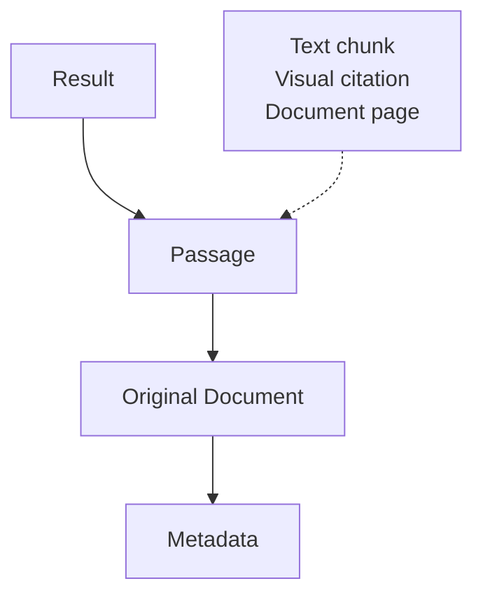

Search your documents and return the most relevant passages based on your natural-language query.



## How it works

When you run Search, TopK:

<Steps>
  <Step title="Searches across your documents">
    TopK searches one or more datasets for the passages most relevant to the query.
  </Step>
  <Step title="Ranks the best matches">
    Results are ranked by relevance so the highest-signal passages come first.
  </Step>
  <Step title="Returns passages with document context">
    Each result includes the matched passage, document ID, dataset, page references, and requested metadata.
  </Step>
</Steps>

For example, for the query:

```text
What does the policy say about contractor access?
```

results look like this:

```json title="Example search results" expandable
[
  {
    "doc_id": "vendor-access-policy",
    "doc_type": "application/pdf",
    "dataset": "policies",
    "content": {
      "chunk": {
        "text": "Contractors may be granted access only through approved, time-limited credentials.",
        "doc_pages": [4]
      }
    },
    "metadata": {
      "title": "Vendor Access Policy",
      "department": "finance",
      "year": 2024
    }
  },
  {
    "doc_id": "security-standards",
    "doc_type": "text/markdown",
    "dataset": "policies",
    "content": {
      "chunk": {
        "text": "All contractor access must be sponsored by a full-time employee and reviewed on a quarterly basis.",
        "doc_pages": []
      }
    },
    "metadata": {
      "title": "Security Standards",
      "department": "it",
      "year": 2024
    }
  },
  {
    "doc_id": "access-control-diagram",
    "doc_type": "image/png",
    "dataset": "policies",
    "content": {
      "image": {
        "data": "iVBORw0KGgoAAAANSUhEUgAAAMgAAADICAYAAACtWK6eAAAABmJLR0QA/wD/AP+gvaeTAAAF...",
        "mime_type": "image/png"
      }
    },
    "metadata": {
      "title": "Access Control Diagram",
      "department": "it"
    }
  }
]
```

Search gives you the evidence directly, without deciding how to interpret it. 

This makes it useful for:

- RAG pipelines
- building custom answering or summarization layers on top of retrieved passages
- feeding high-signal evidence into agents or downstream workflows
- inspecting and verifying source passages directly
- semantic search in applications

## Usage

Once your documents are processed, you can start retrieving relevant passages immediately.

<Tabs>
  <Tab title="CLI" icon="terminal">
    ```bash
    topk search "travel reimbursement policy" -d policies
    ```
    
    <Tip>
      Alternatively, pass `--top-k` to control the number of results (defaults to 10):

      ```bash
      topk search "travel reimbursement policy" -d policies --top-k 20
      ```
    </Tip>
  </Tab>
  <Tab title="Python SDK" icon="/icons/python.svg">
    <CodeGroup>
      ```python Sync
      import os
      from topk_sdk import Client

      client = Client(
          api_key=os.environ.get("TOPK_API_KEY"),
          region="aws-us-east-1-elastica",
      )

      results = client.search(
          query="travel reimbursement policy",
          datasets=["policies"],
          top_k=10,
      )

      print(results)
      ```

      ```python Async
      import os
      import asyncio
      from topk_sdk import AsyncClient

      client = AsyncClient(
          api_key=os.environ.get("TOPK_API_KEY"),
          region="aws-us-east-1-elastica",
      )

      async def main() -> None:
          results = await client.search(
              query="travel reimbursement policy",
              datasets=["policies"],
              top_k=10,
          )
          print(results)

      asyncio.run(main())
      ```
    </CodeGroup>
  </Tab>
  <Tab title="JavaScript SDK" icon="/icons/js.svg">
    ```typescript
    import { Client } from "topk-js";

    const client = new Client({
      apiKey: process.env.TOPK_API_KEY,
      region: "aws-us-east-1-elastica",
    });

    const results = await client.search("travel reimbursement policy", ["policies"], 10);

    console.log(results);
    ```
  </Tab>
</Tabs>

## Scoping the search

Query across multiple datasets or apply document filters to narrow the scope of the query.

### Scoping to specific datasets

This is useful when you want:

- More targeted results
- Less ambiguity across unrelated document sets
- Tighter control over what content an agent is allowed to see

<Tabs>
  <Tab title="CLI" icon="terminal">
    Use `-d` / `--dataset` (repeatable):

    ```bash
    topk search "What was the total net income of Bank of America in 2024?" -d finance -d compliance
    ```
  </Tab>
  <Tab title="Python SDK" icon="/icons/python.svg">
    To specify the datasets to search against, pass them in `datasets=`:

    <CodeGroup>
      ```python Sync
      import os
      from topk_sdk import Client

      client = Client(
          api_key=os.environ.get("TOPK_API_KEY"),
          region="aws-us-east-1-elastica",
      )

      results = client.search(
          query="What was the total net income of Bank of America in 2024?",
          datasets=["finance", "compliance"],
          top_k=10,
      )
      ```

      ```python Async
      import os
      import asyncio
      from topk_sdk import AsyncClient

      client = AsyncClient(
          api_key=os.environ.get("TOPK_API_KEY"),
          region="aws-us-east-1-elastica",
      )

      async def main() -> None:
          results = await client.search(
              query="What was the total net income of Bank of America in 2024?",
              datasets=["finance", "compliance"],
              top_k=10,
          )

      asyncio.run(main())
      ```
    </CodeGroup>
  </Tab>
  <Tab title="JavaScript SDK" icon="/icons/js.svg">
    To specify the datasets to search against, pass them in the `datasets` argument:

    ```typescript
    const results = await client.search(
      "What was the total net income of Bank of America in 2024?",
      ["finance", "compliance"],
      10,
    );
    ```
  </Tab>
</Tabs>

### Filter documents

Sometimes a dataset might contain documents that should not be considered for the query. You can filter out documents that don't match your criteria by providing a [filter expression](/documents/query#filtering).

These filter expressions operate on the **metadata fields** of documents.

For example, if you uploaded documents with metadata such as `department`, `year`, `doc_type`, or `author`, you can use those fields to limit what Ask is allowed to retrieve.

This is useful when you want to query:

- Documents within a specific time range
- Documents matching a particular category or type
- Documents associated with a specific group or owner
- Documents the user is permitted to access

<Tabs>
  <Tab title="Python SDK" icon="/icons/python.svg">
    <CodeGroup>
      ```python Sync
      import os
      from topk_sdk import Client
      from topk_sdk.query import field

      client = Client(
          api_key=os.environ.get("TOPK_API_KEY"),
          region="aws-us-east-1-elastica",
      )

      results = client.search(
          query="travel reimbursement limit",
          datasets=[
              {
                  "dataset": "policies",
                  "filter": field("department").eq("finance").and_(
                      field("year").eq(2024)
                  ),
              }
          ],
          top_k=10,
      )
      ```

      ```python Async
      import os
      import asyncio
      from topk_sdk import AsyncClient
      from topk_sdk.query import field

      client = AsyncClient(
          api_key=os.environ.get("TOPK_API_KEY"),
          region="aws-us-east-1-elastica",
      )

      async def main() -> None:
          results = await client.search(
              query="travel reimbursement limit",
              datasets=[
                  {
                      "dataset": "policies",
                      "filter": field("department").eq("finance").and_(
                          field("year").eq(2024)
                      ),
                  }
              ],
              top_k=10,
          )

      asyncio.run(main())
      ```
    </CodeGroup>
  </Tab>
  <Tab title="JavaScript SDK" icon="/icons/js.svg">
    ```typescript
    import { field } from "topk-js/query";

    const results = await client.search(
      "travel reimbursement limit",
      [
        {
          dataset: "policies",
          filter: field("department").eq("finance").and(field("year").eq(2024)),
        },
      ],
      10,
    );
    ```
  </Tab>
</Tabs>

Use source-level filters when the restriction is part of where the search should look. That keeps retrieval focused and improves the quality of the returned matches.

## Retrieving metadata

The passage text alone is often not enough. You may also want metadata such as title, author, date, or any custom fields you attached during upload — to render richer results, group by source attributes, or carry context into downstream agents.

<Tabs>
  <Tab title="CLI" icon="terminal">
    Use `--field` (repeatable):

    ```bash
    topk search "refund policy" -d policies --field title --field author --field year
    ```
  </Tab>
  <Tab title="Python SDK" icon="/icons/python.svg">
    Use `select_fields`:

    <CodeGroup>
      ```python Sync
      import os
      from topk_sdk import Client

      client = Client(
          api_key=os.environ.get("TOPK_API_KEY"),
          region="aws-us-east-1-elastica",
      )

      results = client.search(
          query="refund policy",
          datasets=["policies"],
          top_k=10,
          select_fields=["title", "author", "year"],
      )
      ```

      ```python Async
      import os
      import asyncio
      from topk_sdk import AsyncClient

      client = AsyncClient(
          api_key=os.environ.get("TOPK_API_KEY"),
          region="aws-us-east-1-elastica",
      )

      async def main() -> None:
          results = await client.search(
              query="refund policy",
              datasets=["policies"],
              top_k=10,
              select_fields=["title", "author", "year"],
          )

      asyncio.run(main())
      ```
    </CodeGroup>
  </Tab>
  <Tab title="JavaScript SDK" icon="/icons/js.svg">
    Use `selectFields`:

    ```typescript
    const results = await client.search(
      "refund policy",
      ["policies"],
      10,
      { selectFields: ["title", "author", "year"] },
    );
    ```
  </Tab>
</Tabs>

The requested metadata appears on each returned result.
