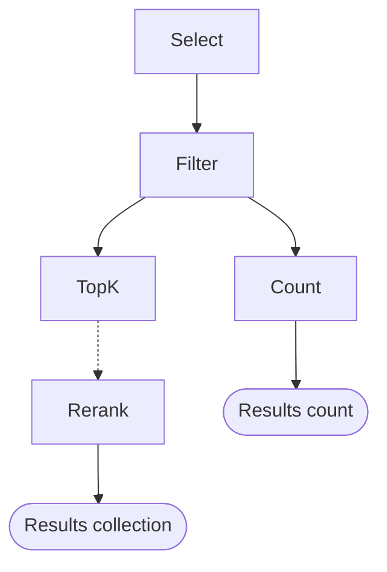

TopK provides a data frame-like syntax for querying documents. It features built-in **semantic search**, **text search**, **vector search**, metadata **filtering** as well as **reranking** capabilities.

With TopK's declarative query builder, you can easily select fields, chain filters, and apply vector/text search in a composable manner.

## Query structure

In TopK, a query consists of multiple stages:

- **Select stage** - Select static or computed fields that will be returned in the query results
  - these fields can be used in stages such as Filter, TopK or Rerank
- **Filter stage** - Filter the documents that will be returned in the query results
  - filters can be applied to static fields, computed fields such as `vector_distance()` or `semantic_similarity()` or custom properties computed inside `select()`
- **TopK stage** - Return the top `k` results based on the provided logical expression
- **Count stage** - Return the total number of documents matching the query
- **Rerank stage** - Rerank the results

All queries **must** have either TopK or Count collection stage.

<Tip>
  You can stack multiple select and filter stages in a single query.
</Tip>

A typical query in TopK looks as follows:



<style>
  {`
  .mermaid {
  text-align: center;
  }
  `}
</style>

## Select

The `select()` function is used to initialize the select stage of a query. It accepts a key-value pair of field names and field expressions:

<CodeGroup>

```python Python
from topk_sdk.query import select, field

client.collection("books").query(
  select(
    "published_year", # elect the static fields directly
    title=field("title"),
  )
  ...
)
```


```js Javascript
import { select, field } from "topk-js/query";

await client.collection("books").query(
  select({
    title: field("title"),
  })
  ...
)
```

</CodeGroup>

### Select expressions

Use a `field()` function to select fields from a document. In the select stage, you can also rename existing fields
or define computed fields using [function expressions](#function-expressions).

<CodeGroup>

```python Python
from topk_sdk.query import select, field

docs = client.collection("books").query(
    select(
        "title", # the actual "title" field from the document
        year=field("published_year"), # renamed field
        year_plus_ten=field("published_year") + 10, # computed field
    )
)
```


```js Javascript
import { select, field } from "topk-js/query";

const docs = await client.collection("books").query(
  select({
    title: field("title"), // the actual "title" field from the document
    year: field("published_year"), // renamed field
    year_plus_ten: field("published_year").add(10), // computed field
  })
);
```

</CodeGroup>

### Function expressions

Function expressions are used to define computed fields that will be included in your query results. TopK currently supports three main function expressions:

- `vector_distance(field, vector)`: Computes distance between vectors for vector search. This function is available for all dense and sparse vector types.
- `bm25_score()`: Calculates relevance scores using the BM25 algorithm for keyword search
- `semantic_similarity(field, query)`: Measures semantic similarity between the provided text query and the field's embedding


#### Vector distance

The `vector_distance()` function is used to compute the vector score between a query vector and a vector field in a collection.

There are **multiple ways** to represent a query vector:

- Dense vectors:
  - `[0.1, 0.2, 0.3, ...]` - Array of numbers resolved as a **dense float32 vector**
  - `f32_vector([...])` - Helper function returning a **dense float32 vector**
  - `u8_vector([...])` - Helper function returning a **dense u8 vector**
  - `binary_vector([...])` - Helper function returning a **binary vector**

- Sparse vectors:
  - `{ 0: 0.1, 1: 0.2, 2: 0.3, ... }` - Mapping from index → value resolved as a **sparse float32 vector**
  - `f32_sparse_vector({ ... })` - Helper function returning a **sparse float32 vector**
  - `u8_sparse_vector({ ... })` - Helper function returning a **sparse u8 vector**

<Tip>
  See the [Helper functions](./helper-functions) page for details on how to use vector helper functions.
</Tip>

Optionally, uses can provide `skip_refine=True` to bypass the internal distance refinement step. This will improve performance for queries with larget `top_k` at the cost of lower accuracy.

<Warning>
  We don't recommend using `skip_refine=True` unless you're using large `top_k` and a custom reranking model to get the final ranking.
</Warning>

<Warning>
  To use the `vector_distance()` function, you **must** have a [**vector index**](http://docs.topk.io/collections/create#vector-index) defined on the field you're computing the vector distance against:
</Warning>

<CodeGroup>

```python Python
from topk_sdk.query import select, field, fn

docs = client.collection("books").query(
    select(
        "title",
        title_similarity=fn.vector_distance(
          "title_embedding",
          [0.1, 0.2, 0.3, ...] # embedding for "animal"
        )
    )
    .topk(field("title_similarity"), 10)
)

# Example result:
[
  {
    "_id": "2",
    "title": "To Kill a Mockingbird",
    "title_similarity": 0.7484796643257141
  },
  {
    "_id": "1",
    "title": "The Catcher in the Rye",
    "title_similarity": 0.5471329569816589
  }
]
```


```js Javascript
import { select, field, fn } from "topk-js/query";

const docs = await client.collection("books").query(
  select({
    title: field("title"),
    title_similarity: fn.vectorDistance(
      "title_embedding",
      [0.1, 0.2, 0.3 /* embedding for "animal" */]
    ),
  })
);

// Example result:
[
  {
    _id: '2',
    title: 'To Kill a Mockingbird',
    title_similarity: 0.7484796643257141
  },
  {
    _id: '1'
    title: 'The Catcher in the Rye',
    title_similarity: 0.5471329569816589,
  }
]
```

</CodeGroup>

#### BM25 Score

The BM25 score is a relevance score that can be used to score documents based on their text content.

To use the `fn.bm25_score()` in your query, you **must** include a `match` predicate in your filter stage.

<Warning>
  To use the `fn.bm25_score()` function, you **must** have a [**keyword index**](http://docs.topk.io/collections/create#keyword-index) defined in your collection schema.
</Warning>

<CodeGroup>

```python Python
from topk_sdk.query import select, field, fn, match

docs = client.collection("books").query(
    select(
        "title",
        text_score=fn.bm25_score(),
    )
    .filter(match("Good")) # must include a match predicate
    .topk(field("text_score"), 10)
)

# Example result:
[
  {
    "_id": "1",
    "title": "Good Night, Bat! Good Morning, Squirrel!",
    "text_score": 0.2447269707918167
  },
  {
    "_id": "2",
    "title": "Good Girl, Bad Blood",
    "text_score": 0.20035339891910553
  }
]
```


```js Javascript
import { select, field, fn, match } from "topk-js/query";

const results = await client.collection("books").query(
  select({
    title: field("title"),
    text_score: fn.bm25Score(),
  })
    .filter(match("Good"))
    .topk(field("text_score"), 10)
);

// Example result:
[
  {
    _id: '1',
    title: 'Good Night, Bat! Good Morning, Squirrel!'
    text_score: 0.2447269707918167,
  },
  {
    _id: '2',
    title: 'Good Girl, Bad Blood',
    text_score: 0.20035339891910553
  }
]
```

</CodeGroup>

#### Semantic similarity

The `semantic_similarity()` function is used to compute the similarity between a **text query** and a **text field** in a collection.

To use the `semantic_similarity()` function, you **must** have a [**semantic index**](http://docs.topk.io/collections/create#semantic-index) defined on the field you're computing the similarity on.

<CodeGroup>

```python Python
from topk_sdk.query import select, field, fn

docs = client.collection("books").query(
    select(
        "title",
        title_similarity=fn.semantic_similarity("title", "animal"),
    )
    .topk(field("title_similarity"), 10)
)

# Example result:
[
  {
    "_id": "2",
    "title": "To Kill a Mockingbird",
    "title_similarity": 0.7484796643257141
  },
  {
    "_id": "1",
    "title": "The Catcher in the Rye",
    "title_similarity": 0.5471329569816589
  }
]
```


```js Javascript
import { select, field, fn } from "topk-js/query";

const docs = await client.collection("books").query(
  select({
    title: field("title"),
    title_similarity: fn.semanticSimilarity("title", "animal"),
  })
    .topk(field("title_similarity"), 10)
);

// Example result:
[
  {
    _id: '2',
    title: 'To Kill a Mockingbird',
    title_similarity: 0.7484796643257141
  },
  {
    _id: '1',
    title: 'The Catcher in the Rye',
    title_similarity: 0.5471329569816589
  }
]
```

</CodeGroup>

### Advanced select expressions

TopK doesn't only let you select static fields from your documents or computed fields using function expressions.
You can also use TopK powerful expression language to select fields by chaining arbitrary logical expressions:

<CodeGroup>

```python Python
from topk_sdk.query import select, field

select(
  weight_in_grams=field("weight").mul(1000),
  is_adult=field("age").gt(18),
  published_in_nineteenth_century=field("published_year") >= 1800 & field("published_year") < 1900,
)
```


```js Javascript
import { select, field } from "topk-js/query";

select({
  weight_in_grams: field("weight").mul(1000),
  is_adult: field("age").gt(18),
  published_in_nineteenth_century: field("published_year")
    .gte(1800)
    .and(field("published_year").lt(1900)),
});
```

</CodeGroup>

## Filtering

You can filter documents by **metadata**, **keywords**, **custom properties** computed inside `select()` (e.g. vector similarity or BM25 score) and more.

Filter expressions support all
- [logical operators](#logical-operators),
- [comparison operators](#comparison-operators),
- [mathematical operators](#mathematical-operators).

### Metadata filtering

<CodeGroup>

```python Python
.filter(
    field("published_year") > 1980
)
```


```js Javascript
.filter(field("published_year").gt(1980))
```

</CodeGroup>

### Keyword search

The `match()` function is the backbone of keyword search in TopK.
It allows you to search for documents that contain specific keywords or phrases.

You can configure the `match()` function to:

- Match on multiple terms
- Match only on specific fields
- Use weights to prioritize certain terms

The `match()` function accepts the following parameters:

<ParamField path="token" type="string" required>
  String token to match. Can also contain multiple terms separated by a delimiter which is any **non-alphanumeric** character.
</ParamField>

<ParamField path="options.field" type="string">
  Field to match on.
  If not provided, the function will match on all fields.
</ParamField>

<ParamField path="options.weight" type="number">
  Weight to use for matching.
  If not provided, the function will use the default weight(**1.0**).
</ParamField>

<ParamField path="options.all" type="boolean">
  Use `all` parameter when a text **must** contain all terms(separated by a delimeter)

  - when `all` is `false` (default) it's an equivalent of `OR` operator
  - when `all` is `true` it's an equivalent of `AND` operator
</ParamField>

Searching for a term like `"catcher"` in your documents is as simple as using the `match()` function in the filter stage of your query:

<CodeGroup>

```python Python
from topk_sdk.query import match

.filter(
    match("catcher")
)
```


```js Javascript
import { match } from "topk-js/query";

.filter(match("catcher"))
```

</CodeGroup>

#### Match multiple terms

The `match()` function can be configured to match all terms when using a **delimiter**.

A term delimiter is any **non-alphanumeric** character.

To ensure that all terms are matched, use the `all` parameter:

<CodeGroup>

```python Python
from topk_sdk.query import match

.filter(match("catcher|rye", field="title", all=True))
```


```js Javascript
import { match } from "topk-js/query";

.filter(match("catcher|rye", { field: "title", weight: 1, all: true }))
```

</CodeGroup>

#### Give weight to specific terms

You can give weight to specific terms by using the `weight` parameter:

<CodeGroup>

```python Python
from topk_sdk.query import match

.filter(match("catcher", weight=2.0) | match("rye", weight=1.0))
```


```js Javascript
import { match } from "topk-js/query";

.filter(match("catcher", { weight: 2.0 }).or(match("rye", { weight: 1.0 })))
```

</CodeGroup>

### Combine keyword search and metadata filtering

You can combine metadata filtering and keyword search in a single query by stacking multiple filter stages.

In the example below, we're searching for documents that contain the keyword `"catcher"` and were published in `1997`, or between `1920` and `1980`.

<CodeGroup>

```python Python
.filter(
    match("catcher")
)
.filter(
    field("published_year") == 1997 | ((field("published_year") >= 1920 & field("published_year") <= 1980))
)
```


```js Javascript
.filter(
  match("catcher")
)
.filter(
  field("published_year").eq(1997).or(field("published_year").gte(1920).and(field("published_year").lte(1980)))
)
```

</CodeGroup>

## Operators

When writing queries, you can use the following operators for:
- field selection
- filtering
- topk collection

### Logical operators

Logical operators combine multiple expressions by applying boolean logic and conditions.

#### and

The `and` operator can be used to combine multiple logical expressions.

<CodeGroup>

```python Python
.filter(
    field("published_year") == 1997 & field("title") == "The Catcher in the Rye"
)

# or

.filter(
    field("published_year").eq(1997).and_(field("title").eq("The Catcher in the Rye"))
)
```


```js Javascript
.filter(
  field("published_year").eq(1997).and(field("title").eq("The Catcher in the Rye"))
)
```

</CodeGroup>

#### or

The `or` operator can be used to combine multiple logical expressions.

<CodeGroup>

```python Python
.filter(
    field("published_year") == 1997 | field("title") == "The Catcher in the Rye"
)

# or

.filter(
    field("published_year").eq(1997).or_(field("title").eq("The Catcher in the Rye"))
)
```


```js Javascript
.filter(
  field("published_year").eq(1997).or(field("title").eq("The Catcher in the Rye"))
)
```

</CodeGroup>

#### not

The `not` helper can be used to **negate** a logical expression. It takes an expression as an argument and inverts its logic.

<CodeGroup>

```python Python
from topk_sdk.query import field, not_

.filter(
    not_(field("title").contains("Catcher"))
)
```


```typescript Javascript
import { field, not } from "topk-js/query";

.filter(
    not(field("title").contains("Catcher"))
)
```

</CodeGroup>

#### all

The `all()` helper evaluates to `true` if each expression in the array is true. It's equivalent to applying the logical AND operator across all expressions.

<CodeGroup>

```python Python
from topk_sdk.query import all, field

.filter(
    all([
        field("published_year") >= 1900,
        field("published_year") <= 2000,
        field("title").is_not_null()
    ])
)
```

```typescript Javascript
import { all, field } from "topk-js/query";

.filter(
  all([
    field("published_year").gte(1900),
    field("published_year").lte(2000),
    field("title").isNotNull()
  ])
)
```

</CodeGroup>

This is equivalent to:

<CodeGroup>

```python Python
field("published_year") >= 1900 & field("published_year") <= 2000 & field("title").is_not_null()
```

```typescript Javascript
field("published_year").gte(1900).and(field("published_year").lte(2000)).and(field("title").isNotNull())
```

</CodeGroup>

#### any

The `any()` helper evaluates to `true` if at least one expression in the array is true. It's equivalent to applying the logical OR operator across all expressions.

<CodeGroup>

```python Python
from topk_sdk.query import any, field

.filter(
    any([
        field("genre") == "fiction",
        field("genre") == "mystery",
        field("genre") == "thriller"
    ])
)
```

```typescript Javascript
import { any, field } from "topk-js/query";

.filter(
  any([
    field("genre").eq("fiction"),
    field("genre").eq("mystery"),
    field("genre").eq("thriller")
  ])
)
```

</CodeGroup>

This is equivalent to:

<CodeGroup>

```python Python
field("genre") == "fiction" | field("genre") == "mystery" | field("genre") == "thriller"
```

```typescript Javascript
field("genre").eq("fiction").or(field("genre").eq("mystery")).or(field("genre").eq("thriller"))
```

</CodeGroup>


#### choose

The `choose` operator evaluates a condition and returns the first argument if the condition is true, else the second argument.

<CodeGroup>

```python Python
select(
  summary=(field("book_type") == "fiction").choose(
      field("plot_summary"),
      field("technical_summary")
  )
)
```


```js Javascript
select({
  summary: field("book_type").eq("fiction").choose(
    field("plot_summary"),
    field("technical_summary")
  ),
})
```

</CodeGroup>

#### boost

The `boost` operator multiplies the scoring expression by the provided `boost` value if the `condition` is true.
Otherwise, the scoring expression is unchanged (multiplied by 1).

<CodeGroup>

```python Python
select(
  summary_distance=fn.vector_distance("summary_embedding", [2.3] * 16)
).topk(
  field("summary_distance").boost(field("summary").match_all("deep learning"), 1.5),
  10,
  false
)
# this boost expression is equivalent to
# field("summary_distance") * (field("summary").match_all("deep learning").choose(1.5, 1.0)),
```


```js Javascript
select({
  summary_distance: fn.vectorDistance("summary_embedding", Array(16).fill(2.3)),
}).topk(
  field("summary_distance").boost(field("summary").matchAll("deep learning"), 1.5),
  10,
  false
)
// this boost expression is equivalent to
// field("summary_distance").mul(field("summary").matchAll("deep learning").choose(1.5, 1.0)),
```

</CodeGroup>

#### coalesce

The `coalesce` operator replaces `null` values with a provided value.

<CodeGroup>

```python Python
select(importance=field("nullable_importance").coalesce(1.0))
```


```js Javascript
select({
  importance: field("nullable_importance").coalesce(1.0)
})
```

</CodeGroup>

### Comparison operators

Comparison operators provide various logical, numerical and string functions that evaluate to true or false.

#### eq

The `eq` operator can be used to match documents that have a field with a specific value.

<CodeGroup>

```python Python
.filter(
    field("published_year") == 1997
)

# or

.filter(
    field("published_year").eq(1997)
)
```


```js Javascript
.filter(field("published_year").eq(1997))
```

</CodeGroup>

#### ne

The `ne` operator can be used to match documents that have a field with a value that is not equal to a specific value.

<CodeGroup>

```python Python
.filter(
    field("published_year") != 1997
)

# or

.filter(
    field("published_year").ne(1997)
)
```


```js Javascript
.filter(field("published_year").ne(1997))
```

</CodeGroup>

#### is_null

The `is_null` operator can be used to match documents that have a field with a value that is `null`.

<CodeGroup>

```python Python
.filter(
    field("title").is_null()
)
```


```js Javascript
.filter(field("title").isNull())
```

</CodeGroup>

#### is_not_null

The `is_not_null` operator can be used to match documents that have a field with a value that is not `null`.

<CodeGroup>

```python Python
.filter(
    field("title").is_not_null()
)
```

```js Javascript
.filter(field("title").isNotNull())
```

</CodeGroup>

#### gt

The `gt` operator can be used to match documents that have a field with a value greater than a specific value.

<CodeGroup>

```python Python
.filter(
    field("published_year") > 1997
)

# or

.filter(
    field("published_year").gt(1997)
)
```


```js Javascript
.filter(field("published_year").gt(1997))
```

</CodeGroup>

#### gte

The `gte` operator can be used to match documents that have a field with a value greater than or equal to a specific value.

<CodeGroup>

```python Python
.filter(
    field("published_year") >= 1997
)

# or

.filter(
    field("published_year").gte(1997)
)
```


```js Javascript
.filter(field("published_year").gte(1997))
```

</CodeGroup>

#### lt

The `lt` operator can be used to match documents that have a field with a value less than a specific value.

<CodeGroup>

```python Python
.filter(
    field("published_year") < 1997
)

# or

.filter(
    field("published_year").lt(1997)
)
```


```js Javascript
.filter(field("published_year").lt(1997))
```

</CodeGroup>

#### lte

The `lte` operator can be used to match documents that have a field with a value less than or equal to a specific value.

<CodeGroup>

```python Python
.filter(
    field("published_year") <= 1997
)

# or

.filter(
    field("published_year").lte(1997)
)
```


```js Javascript
.filter(field("published_year").lte(1997))
```

</CodeGroup>

#### starts_with

The `starts_with` operator can be used on string fields to match documents that start with a given prefix. This is especially
useful in multi-tenant applications where document IDs can be structured as `{tenant_id}/{document_id}` and `starts_with` can
then be used to scope the query to a specific tenant.

<CodeGroup>

```python Python
.filter(
    field("_id").starts_with("tenant_123/")
)
```


```js Javascript
.filter(field("_id").startsWith("tenant_123/"))
```

</CodeGroup>

#### contains

The `contains` operator can be used on both text fields and list fields to match documents that include a specific value. For text fields, it matches documents that include a specific substring (case-sensitive). For list fields, it matches documents where the field of type list contains the specified value.

* [**Text fields**](/collections/create#text): Matches documents that include a specific substring. It is **case-sensitive** and avoids the text processing pipeline (tokenization and stemming) used by the [`match()`](#keyword-search) function. This makes it particularly useful when you need exact substring matching or want to provide your own pre-processed tokens. Unlike `match()`, the `contains` operator can be used without requiring a keyword index.
* [**List fields**](/collections/create#list): Matches documents where the list field contains the specified value. The value can be a literal or a field reference. You can also use a list of strings with a keyword index if you want to provide your own tokens instead of using the text processing pipeline.

<CodeGroup>

```python Python
# String contains
.filter(
    field("title").contains("Catcher")
)

# List contains
.filter(
    # Tags is a text list field: ["novel", "fiction", "science-fiction"]
    field("tags").contains("novel")
)

# List contains combined with a field reference
.filter(
    field("codes").contains(field("slug"))
)
```


```typescript Javascript
// String contains
.filter(field("title").contains("Catcher"))

// List contains
.filter(field("tags").contains("novel"))

// List contains combined with a field reference
.filter(field("codes").contains(field("slug")))
```

</CodeGroup>

<Info>
  The `contains` operator works exactly the same as the `in` operator, but with reversed operands: `x CONTAINS y` is equivalent to `y IN x`. Both operators are provided for convenience and to make queries more readable.
</Info>

#### in

The `in` (or `in_` in Python) operator checks if a field value is present in a list of values, string literal or another field. It can be used in several ways:

* **Field in list**: Checks if a field value is present in a list of literal values.
* **Field in string**: Checks if a string field is a substring of another string. Unlike the [`match()`](#keyword-search), this avoids the text processing pipeline (tokenization and stemming) and performs exact substring matching.
* **Field in field**: Checks if a field value is present in another field.

<CodeGroup>

```python Python
# Field in list of literals
.filter(
    field("published_year").in_([1999, 1988, 1997])
)

# Field in string
.filter(
    field("slug").in_("harry-potter lord-of-the-rings")
)

# Field in another field (list)
.filter(
    field("_id").in_(field("tags"))
)
```


```typescript Javascript
// Field in list of literals
.filter(field("published_year").in([1999, 1988, 1997]))

// Field in string
.filter(field("slug").in("harry-potter lord-of-the-rings"))

// Field in another field (list)
.filter(field("_id").in(field("tags")))
```

</CodeGroup>

<Info>
  The `in` operator works exactly the same as the `contains` operator, but with reversed operands: `y IN x` is equivalent to `x CONTAINS y`. Both operators are provided for convenience and to make queries more readable.
</Info>

#### match_all

The `match_all` operator returns `true` if all terms in the query are present in the field with a keyword index.

<CodeGroup>

```python Python
.filter(
  field("summary").match_all("love marriage england")
)
# you can also pass a list of strings:
.filter(
  field("summary").match_all(["love", "marriage", "england"])
)
```

```js Javascript
.filter(field("summary").matchAll("love marriage england"))
// you can also pass an array of strings:
.filter(field("summary").matchAll(["love", "marriage", "england"]))
```
</CodeGroup>

<Info>
When using a `match_all` operator against a text field, it must be used in conjunction with a [**keyword index**](/collections/create#keyword-index) defined in your collection schema.
</Info>

#### match_any

The `match_any` operator returns `true` if any term in the query is present in the field with a keyword index.

<CodeGroup>

```python Python
.filter(
    field("summary").match_any("love ring")
)
# you can also pass a list of strings:
.filter(
  field("summary").match_any(["love", "ring"])
)
```

```js Javascript
.filter(field("summary").matchAny("love ring"))
// you can also pass an array of strings:
.filter(field("summary").matchAny(["love", "ring"]))
```

</CodeGroup>

<Info>
When using a `match_any` operator against a text field, it must be used in conjunction with a [**keyword index**](/collections/create#keyword-index) defined in your collection schema.
</Info>

### Mathematical operators

Mathematical operators perform computations on numbers.

#### add

The `add` operator can be used to add two numbers.

<CodeGroup>

```python Python
.filter(
    field("published_year") + 1997
)

# or

.filter(
    field("published_year").add(1997)
)
```


```js Javascript
.filter(field("published_year").add(1997))
```

</CodeGroup>

#### sub

The `sub` operator can be used to subtract two numbers.

<CodeGroup>

```python Python
.filter(
    field("published_year") - 1997
)

# or

.filter(
    field("published_year").sub(1997)
)
```


```js Javascript
.filter(field("published_year").sub(1997))
```

</CodeGroup>

#### mul

The `mul` operator can be used to multiply two numbers.

<CodeGroup>

```python Python
.filter(
    field("published_year") * 1997
)

# or

.filter(
    field("published_year").mul(1997)
)
```


```js Javascript
.filter(field("published_year").mul(1997))
```

</CodeGroup>

#### div

The `div` operator can be used to divide two numbers.

<CodeGroup>

```python Python
.filter(
    field("published_year") / 1997
)

# or

.filter(
    field("published_year").div(1997)
)
```


```js Javascript
.filter(field("published_year").div(1997))
```

</CodeGroup>

#### abs

The `abs` operator returns the absolute value of a number, which is useful for calculating distances or differences.

<CodeGroup>

```python Python
from topk_sdk.query import abs

# Find books published closest to 1990
select(
    delta=abs(field("published_year").sub(1990))
)
```

```js Javascript
import { abs } from "topk-js/query";

// Find books published closest to 1990
select({
  delta: abs(field("published_year").sub(1990))
})
```

</CodeGroup>

#### min

The `min` operator returns the smaller of two values, commonly used for clamping or setting upper bounds. It can work with both scalar values and other fields or expressions.

<CodeGroup>

```python Python
from topk_sdk.query import min

# Clamp BM25 scores to a maximum of 2.0
select(
    clamped_score=min(field("bm25_score"), 2.0)
)

# Take the lower of critic score vs user rating
select(
    conservative_score=min(field("critic_score"), field("user_rating"))
)
```

```js Javascript
import { min } from "topk-js/query";

// Clamp BM25 scores to a maximum of 2.0
select({
  clamped_score: min(field("bm25_score"), 2.0)
})

// Take the lower of critic score vs user rating
select({
  conservative_score: min(field("critic_score"), field("user_rating"))
})
```

</CodeGroup>

#### max

The `max` operator returns the larger of two values, commonly used for clamping or setting lower bounds. It can work with both scalar values and other fields or expressions.

<CodeGroup>

```python Python
from topk_sdk.query import max

# Ensure minimum relevance score of 1.5
select(
    boosted_score=max(field("relevance_score"), 1.5)
)

# Take the higher of critic score vs user rating
select(
    best_score=max(field("critic_score"), field("user_rating"))
)
```

```js Javascript
import { max } from "topk-js/query";

// Ensure minimum relevance score of 1.5
select({
  boosted_score: max(field("relevance_score"), 1.5)
})

// Take the higher of critic score vs user rating
select({
  best_score: max(field("critic_score"), field("user_rating"))
})
```

</CodeGroup>

#### ln

The `ln` operator calculates the natural logarithm, useful for logarithmic scaling and dampening large values.

<CodeGroup>

```python Python
# Apply logarithmic dampening to scores
select(
    log_score=(field("raw_score") + 1).ln()
)
```

```js Javascript
// Apply logarithmic dampening to scores
select({
  log_score: field("raw_score").add(1).ln()
})
```

</CodeGroup>

#### exp

The `exp` operator calculates the exponential function (e^x), useful for exponential scaling and boosting.

<CodeGroup>

```python Python
# Apply exponential boosting to BM25 scores
select(
    boosted_score=(field("bm25_score") * 1.5).exp()
)
```

```js Javascript
// Apply exponential boosting to BM25 scores
select({
  boosted_score: field("bm25_score").mul(1.5).exp()
})
```

</CodeGroup>

#### sqrt

The `sqrt` operator calculates the square root, useful for dampening values and creating non-linear transformations.

<CodeGroup>

```python Python
# Dampen large distance values
select(
    dampened_distance=field("vector_distance").sqrt()
)
```

```js Javascript
// Dampen large distance values
select({
  dampened_distance: field("vector_distance").sqrt()
})
```

</CodeGroup>

#### square

The `square` operator multiplies a number by itself (x²), useful for amplifying differences and creating quadratic transformations.

<CodeGroup>

```python Python
# Create quadratic penalty for age differences
select(
    age_penalty=(field("user_age") - 50).square()
)
```

```js Javascript
// Create quadratic penalty for age differences
select({
  age_penalty: field("user_age").sub(50).square()
})
```

</CodeGroup>

## Collection

All queries **must** have a collection stage. Currently, we only support `topk()` and `count()` collectors.

### topk

Use the `topk()` function to return the top `k` results. The `topk()` function accepts the following parameters:

<ParamField path="expr" type="LogicalExpression" required="true">
  The logical expression to sort the results by.
</ParamField>

<ParamField path="k" type="number" required="true">
  The number of results to return.
</ParamField>

<ParamField path="asc" type="boolean" required="false">
  Whether to sort the results in ascending order.
</ParamField>

To get the top 10 results with the highest `title_similarity`, you can use the following query:

<CodeGroup>

```python Python
.topk(field("title_similarity"), 10, asc=False)
```


```typescript Javascript
.topk(field("title_similarity"), 10, false)
```

</CodeGroup>

### count

Use the `count()` function to get the total number of documents matching the query. If there are no filters then `count()` will return the total number of documents in the collection.

<CodeGroup>

```python Python
# Count the total number of documents in the collection
.count()
```


```js Javascript
// Count the total number of documents in the collection
.count()
```

</CodeGroup>

<Info>
  When writing queries, remember that they all require the `topk` or `count` function at the end.
</Info>

## Rerank

The `rerank()` function is used to rerank the results of a query. Read more about it in our [reranking](/concepts/reranking) guide.

<CodeGroup>

```python Python
.rerank()
```


```js Javascript
.rerank()
```

</CodeGroup>

## LSN-based Consistency

TopK supports **LSN (Log Sequence Number)** based consistency for ensuring read-after-write consistency. When you perform a write operation (like `upsert`), you receive an LSN as a **string** that represents the sequence number of that write in the system's log.

You can use this LSN in subsequent queries to ensure that the query only returns results that are at least as recent as that write operation.

### How it works

1. **Write operation**: When you call `lsn = client.collection().upsert()`, you receive an LSN
2. **Query with LSN**: Pass that LSN to `client.collection().query(..., lsn=lsn)`
3. **Consistency guarantee**: If the write is not yet available in the read path, the query will be rejected and the client will automatically retry

This approach ensures that your queries always see the results of your recent writes, providing strong consistency guarantees when needed.

<CodeGroup>

```python Python
# Upsert a document and get the LSN
lsn = client.collection("books").upsert([
    {"_id": "1984", "title": "1984", "author": "George Orwell", "year": 1949}
])

# Query with LSN to ensure consistency
results = client.collection("books").query(
    select("title", "author", "year")
    .filter(field("author") == "George Orwell")
    .topk(field("year"), 10),
    lsn=lsn
)
```

```js Javascript
// Upsert a document and get the LSN
const lsn = await client.collection("books").upsert([
  { _id: "1984", title: "1984", author: "George Orwell", "year": 1949 }
]);

// Query with LSN to ensure consistency
const results = await client.collection("books").query(
  select({ title: field("title"), author: field("author"), year: field("year") })
  .filter(field("author").eq("George Orwell"))
  .topk(field("title"), 10),
  { lsn: lsn }
)
```

</CodeGroup>

<Warning>
  Using LSN-based consistency may increase query latency as the system needs to verify that the specified LSN has been processed before returning results.
</Warning>