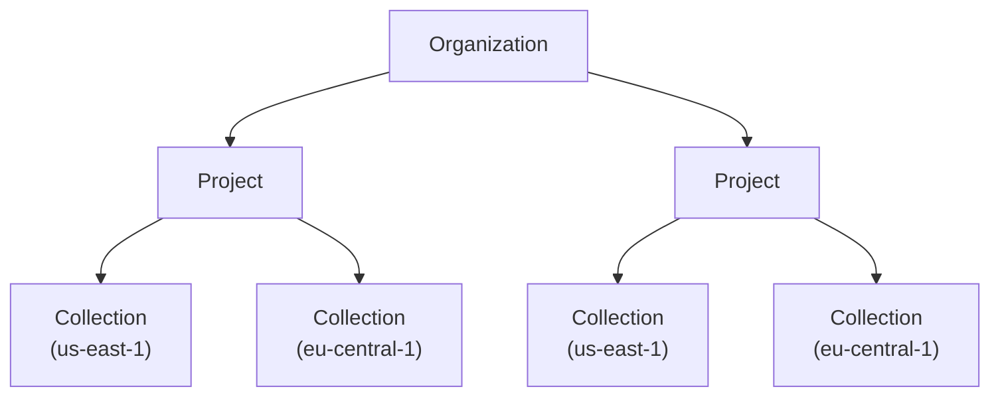

<CodeGroup>

```bash Python
pip install topk-sdk
```


```bash Javascript
npm install topk-js

# or

yarn add topk-js

# or

pnpm add topk-js
```

</CodeGroup>

## TopK Client

To setup a TopK client, you'll need your [API key](#api-key) and region:

<CodeGroup>

```python Python
from topk_sdk import Client

client = Client(api_key="YOUR_TOPK_API_KEY", region="aws-us-east-1-elastica")
```


```typescript Javascript
import { Client } from "topk-js";

const client = new Client({
  apiKey: "YOUR_TOPK_API_KEY",
  region: "aws-us-east-1-elastica"
});
```

</CodeGroup>

`Client` constructor accepts the following parameters:

<ParamField body="api_key" type="string" required>
  The API key for the project. See [below for more details](#api-key).
</ParamField>

<ParamField body="region" type="string" required>
  The region of the project. Available regions are:

  - `aws-us-east-1-elastica`
  - `aws-eu-central-1-monstera`

  Check out the [Regions](/docs/regions) page for more information.
</ParamField>

<ParamField body="host" default="topk.io" type="string">
  The host of the project.
</ParamField>

<ParamField body="https" default="true" type="boolean">
  When using a public host this should always be `true`.
  In most cases it is used for internal purposes.
</ParamField>

<Warning>
  TopK Client is **region-specific**.

  Attempting to access collections or documents outside the specified region will result in a region mismatch error.
</Warning>

## API Key

TopK API key is **project-specific**, so you'll need to obtain an API key for each individual project.

To obtain your API key:

<Steps>
  <Step title="Go to the TopK Console">
    You can visit the console [here](https://console.topk.io).
  </Step>
  <Step title="Authenticate">
    Log in or create your account.
  </Step>
  <Step title="Go to a project">
    Create a project or use an existing one.
  </Step>
  <Step title="Generate an API key">
    Store your API key in a secure location. It can be **viewed only once**.
  </Step>
</Steps>

TopK follows `Organization > Project > Collection` hierarchical structure:



## TopK with Vite/Webpack SSR

If you're using the TopK **JavaScript SDK** in a server-side rendering (SSR) environment, you may need to follow these steps to ensure compatibility:

<AccordionGroup>
  <Accordion title="Using with Vite ?" description="Remix, Nuxt, SvetleKit, Astro ...">
    If you're using `topk-js` in a Vite project with server-side rendering (SSR), you may need to configure Vite to treat it as an external dependency. This ensures compatibility and prevents build-time issues related to SSR or dependency pre-bundling.

    ```typescript
    // vite.config.ts

    export default defineConfig({
      // ...
      ssr: {
        external: ["topk-js"],
      },
      optimizeDeps: {
        exclude: ["topk-js"],
      },
    });
    ```
  </Accordion>
  <Accordion title="Using with Webpack or Turbopack ?" description="Next.js">
    If you're using `topk-js` in a Next.js project (especially with the App Router and Server Components), you may need to mark it as an external package to avoid build issues during server-side bundling.

    ```typescript
    // next.config.ts

    import type { NextConfig } from "next";

    const nextConfig: NextConfig = {
      /* config options here */
      serverExternalPackages: ["topk-js"],
    };

    export default nextConfig;
    ```
  </Accordion>
</AccordionGroup>